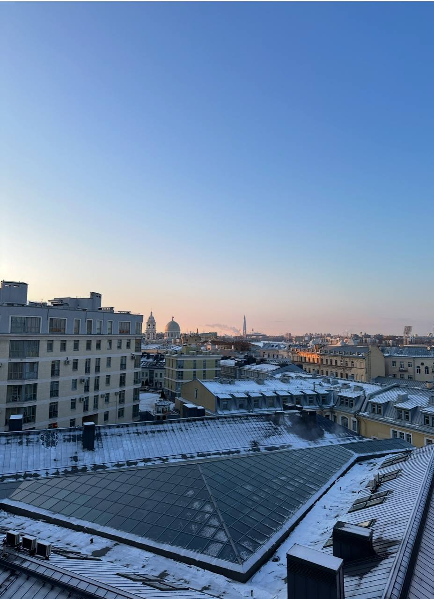
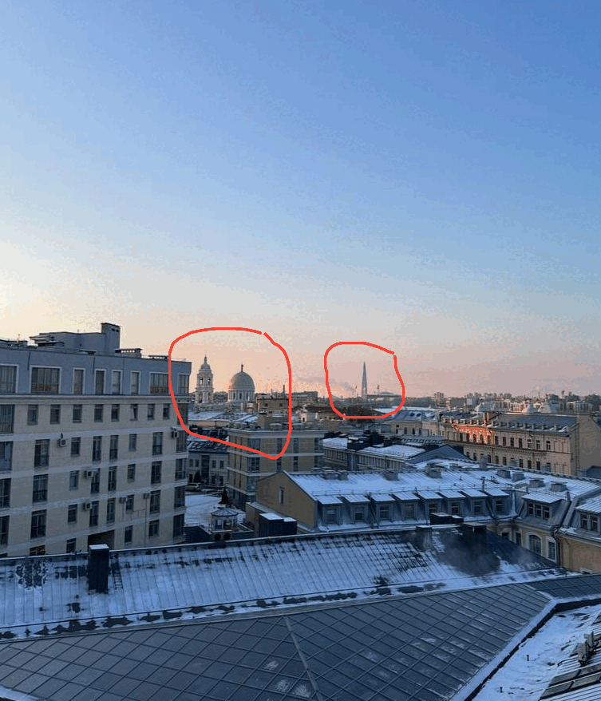
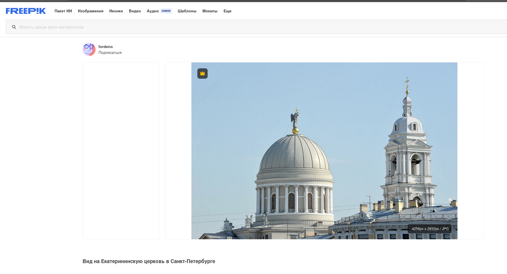
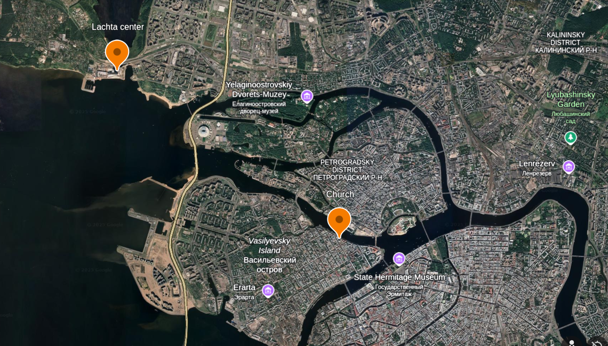
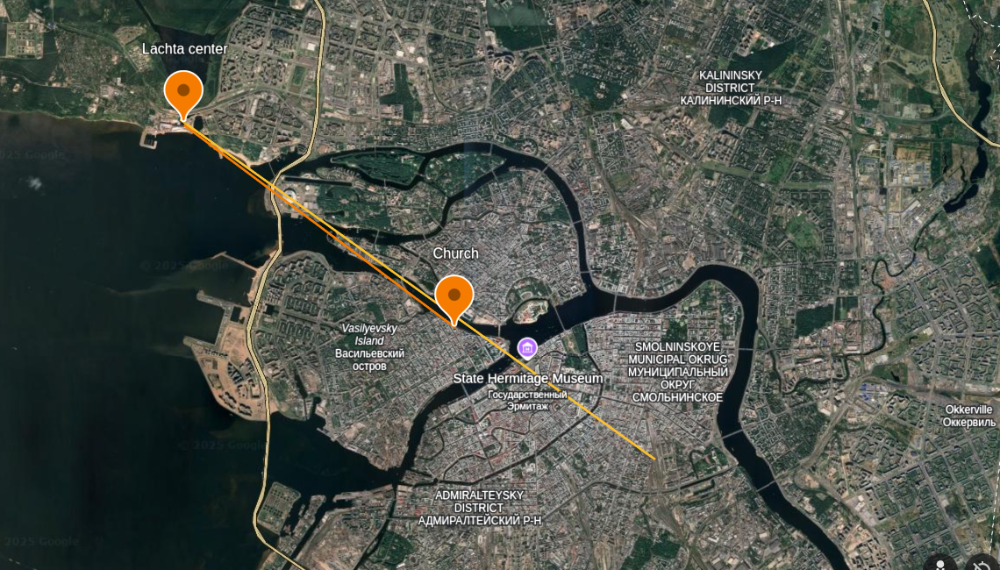
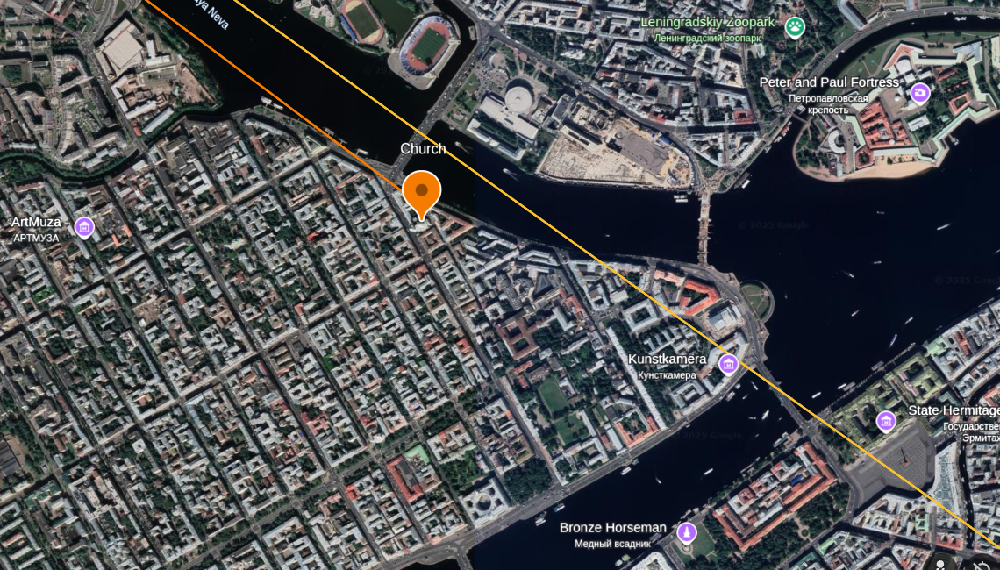
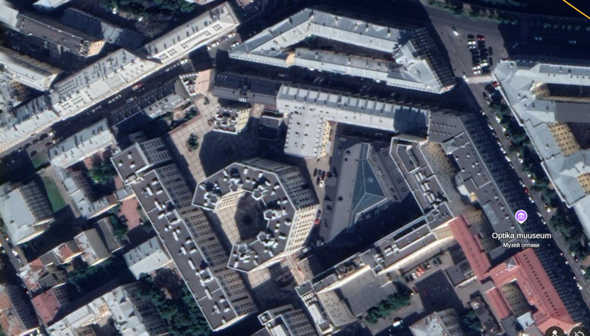
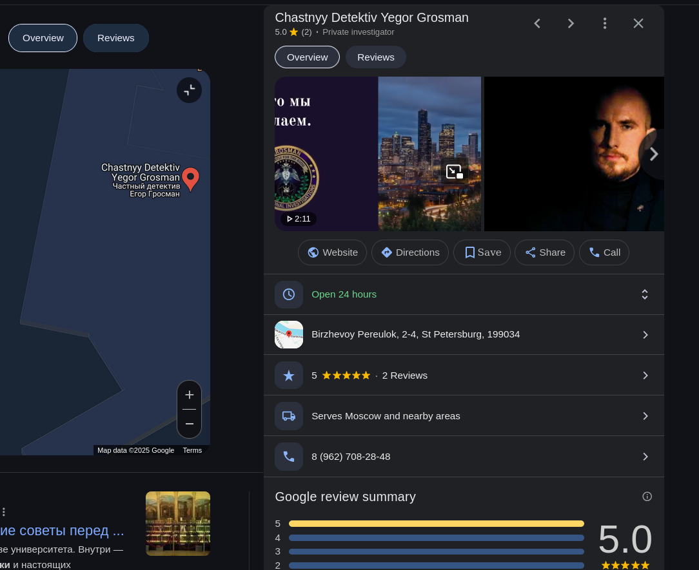

# 🥂 When in Saint Petersburg – drink!

Выберите язык / Choose your language:

- 🇷🇺 [Русский](README.md)  
- 🇬🇧 [English](README.en.md)

> Today I want to share with you a GeoINT task that a sophomore from my department sent me.  
> I didn’t know the official name of the task (at least not at the beginning), so I had to do some experimenting. ^^

### 📖 Enjoy the read!

---

## ⚠️ Disclaimer

> **This write-up is intended for educational and demonstrational purposes only.**

The author does **not** encourage any activities that violate the law, invade privacy, or involve the collection of personal data without consent.  
All methods and ideas described here were used solely for the purpose of **open-source analysis and geospatial reasoning based on publicly available data**.

**GeoINT** is a well-established discipline in academic and analytical circles.  
The investigation in this document does **not** involve tracking or identifying real individuals.

> ❗ **Violating privacy laws, conducting surveillance, or gathering personal data without permission is not only unethical — it's illegal.**  
> If you're into OSINT or GeoINT, do it ethically and legally.

---

## 🧭 Brief

> A photo is given. The goal is to determine the exact location — including street and building number — from which it was taken.

---

## 🧩 Step 1

Looking at the photo, my initial guess was that it was taken in Saint Petersburg.

This hypothesis is supported by the visible Lakhta Center and what appears to be an Orthodox church, based on the placement of the dome and bell tower.

> 💡 ***Information gathered at this stage*** — The photo was taken in Saint Petersburg.

---

## 🔍 Step 2

I decided to identify the church in the background using reverse image search tools.

Among various tourist photos, I found a helpful reference:

> 💡 ***Information gathered at this stage*** — The church in the background is the Catherine Church (Yekaterininskaya Tserkov’).

---

## 🌍 Step 3

Using Google Earth, I marked all the known locations from the photo:

Then I drew lines between them and added an approximate trajectory toward the Lakhta Center:

> 💡 ***Information gathered at this stage*** — The spot where the photo was taken is roughly here:

---

## 🕵️ Step 4

After taking a closer look around the estimated area, I noticed that triangular roof window from the original photo:

Time to triangulate the address! ^^

> 💡 ***Information gathered at this stage*** — The address is **2/4, Birzhevoy Pereulok**

("Private detective"? Coincidence? I don't think so 😄)

---

## 🛠️ Tools Used

1. 🔍 Google Search by Image _(Step 2)_

2. 🔎 Yandex Search by Image _(Step 2)_

3. 🌍 Google Earth _(Step 3)_

4. 🗺️ Google Maps _(Step 4)_

---

### 🎉 Thanks for reading! ^^  

---
