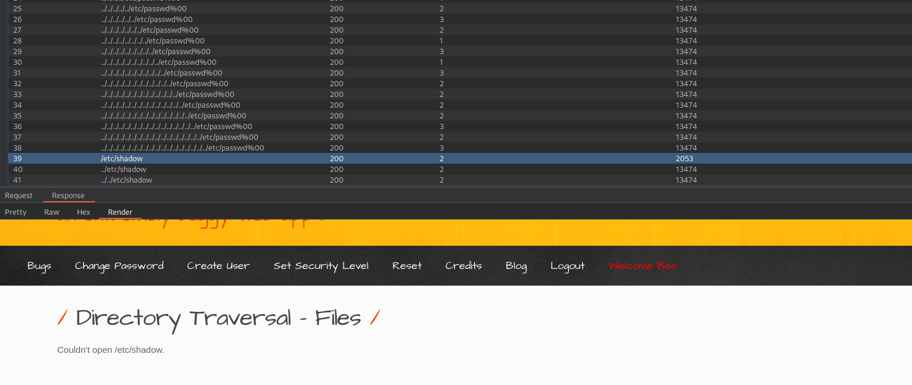

# Directory traversal (Files)
---

Выберите язык / Choose your language:

- 🇷🇺 [Русский](WRITEUP.md)
- 🇬🇧 [English](WRITEUP.en.md)

# Disclaimer
---

**The text was written and translated by the author manually. A language model was used for formatting and stylistic editing.**

**This material is provided for educational and research purposes only. 
I do not encourage or call for unauthorized access to information systems or violation of the law. 
In my opinion, one of the most effective ways to combat cybercrime is to educate both everyday users and managers, as well as developers of digital products about common vulnerabilities that could potentially be exploited by malicious actors to carry out unlawful acts.**

**⚠️ All actions described in this document were performed within an authorized research environment (CTF/test platform), without violating the rights of third parties or current legislation.**

**Unauthorized interference with computer systems, violation of data storage and processing rules, and other forms of so-called "black-hat" hacking are contrary to law and the ethics of information security.**

**I adhere to the principles of ethical research and responsible vulnerability disclosure.**

---

# Introduction
---

The Buggy Web Application (BWAPP) offers a set of challenges dedicated to the ***Directory Traversal Vulnerability*** (***CVE-2004-2687***)

***SECURITY LEVELS COVERED***
- Low
- Medium
# Target
---

# Exploitation (Low security level)
---

A basic Poc Directory Traversal payload revealed the contents of the `etc/passwd` (reading of `etc/group` is also possible) file:

# Exploitation (Medium security level)
---

On higher security levels, the standard payload techniques end up being detected:

Using a large set of payloads, it is possible to bypass the regulations and exploit the vulnerability. What's funny is that the first list entry (`/etc/passwd`) resulted in a succeful attack:

It is worth noting that the fuzzing attack revealed other existing files (`/etc/shadow`, `etc/proc/self/envriron`), which exist yet cannot be acessed likely because of user priveleges:

