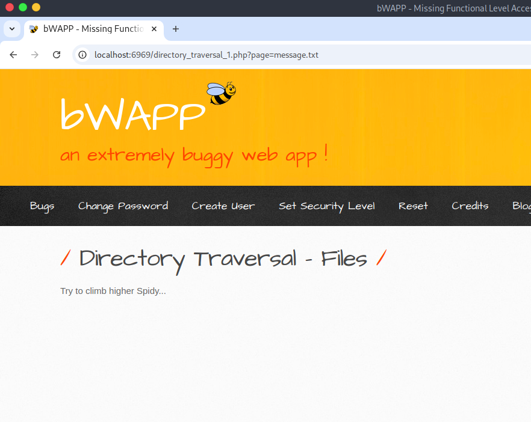
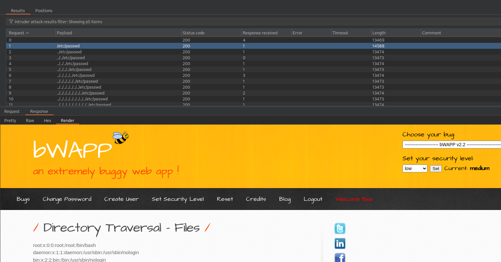
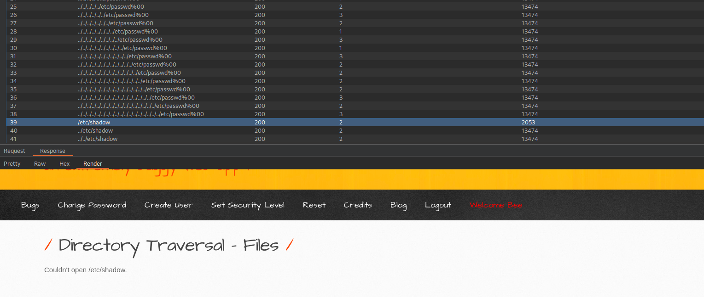

# Directory Traversal (Files)
---

Выберите язык / Choose your language:

- 🇷🇺 [Русский](WRITEUP.md)
- 🇬🇧 [English](WRITEUP.en.md)

# Дисклеймер
---

**Текст написан и переведён автором вручную. Для форматирования и стилистической правки использовалась языковая модель.**

**Данный материал подготовлен исключительно в образовательных и исследовательских целях. 
Я не поощряю и не призываю к осуществлению неправомерного доступа к информационным системам, нарушению законодательства. 
По моему мнению, одним из самых эффективных способов борьбы с киберпреступностью является осведомление как рядовых пользователей и руководителей, так и разработчиков цифровых продуктов о популярных уязвимостях, которые могут быть потенциально использованы злоумышленниками для совершения противоправных актов.**

**⚠️ Все действия, описанные в данном документе, производились в рамках разрешённой исследовательской среды (CTF/тестовая платформа), без нарушения прав третьих лиц и действующего законодательства.**

**Незаконное вмешательство в работу компьютерных систем, нарушение правил хранения и обработки компьютерной информации, а также иные формы так называемого "чёрного" хакерства противоречат закону и этике информационной безопасности.**

**Я придерживаюсь принципов этичного исследования и ответственного раскрытия уязвимостей.**

---

# Введение
---

Buggy Web Application (BWAPP) предлагает набор заданий, посвященных ***Уязвимости обхода директорий*** (***CVE-2004-2687***)

***ОХВАЧЕННЫЕ УРОВНИ БЕЗОПАСНОСТИ***
- Низкий
- Средний

# Приложение
---

# Эксплуатация (Низкий уровень безопасности)
---

Базовая PoC нагрузка для обхода директорий раскрыла содержимое файла `/etc/passwd` (также возможно чтение `/etc/group`):

# Эксплуатация (Средний уровень безопасности)
---

На более высоких уровнях безопасности стандартные техники экспуалатации "обнаруживаются":

Используя большой набор нагрузок, возможно обойти ограничения и эксплуатировать уязвимость. Что забавно, первая запись в списке (`/etc/passwd`) привела к успешной атаке:

Стоит отметить, что фаззинг-атака выявила другие существующие файлы (`/etc/shadow`, `/proc/self/environ`), которые существуют, но доступ к ним невозможен, вероятно, из-за привилегий пользователя:

