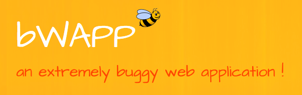

# Penetration Testing Write-Ups | BWAPP



Набор практических write-up'ов по эксплуатации уязвимостей в учебном веб-приложении BWAPP (Buggy Web Application).

## 📁 Содержание (Ссылки на статьи)

- [Directory Traversal (Files)](Directory-Traversal-(Files)/WRITEUP.md)
- [Insecure Direct Object Reference (IDOR)](IDOR-(Tickets)/WRITEUP.md)
- [PHP Code Injection](PHP-Code-Injection/WRITEUP.md)
- [Reflected XSS (GET)](Reflected-XSS-(GET)/WRITEUP.md)
- [SQL Injection (GET Search)](SQL-Injection-(GET-Search)/WRITEUP.md)
- [SQL Injection (GET Select)](SQL-Injection-(GET-Select)/WRITEUP.md)

## ⚠️ Дисклеймер

**ВНИМАНИЕ**: Данные материалы предназначены исключительно для образовательных целей и исследований в области информационной безопасности. Все тестирования проводились в контролируемой лабораторной среде на специально предназначенном для этого учебном приложении. Автор всячески порицает использование описанных техник с целью совершения противоправных действий. Основная цель контента - документирование прогресса в изучение веб уязвимостей и предупреждение читателей о популярных угрозах.

**НЕ ИСПОЛЬЗУЙТЕ эти техники для незаконного доступа к системам без явного разрешения владельцев!**!!!!!!!!!!!!!!!!!!!!!!!!!

## 🛡️ Ответственное раскрытие

Я придерживаюсь принципов этичного хакинга и ответственного раскрытия уязвимостей. Все исследования проводились в соответствии с:

- Принципами OWASP
- Стандартами этичного тестирования на проникновение
- Локальным и международным законодательством

## 📊 Покрытые уязвимости

| Уязвимость          | Уровни сложности | OWASP Category |
| ------------------- | ---------------- | -------------- |
| Directory Traversal | Low, Medium      | A01:2021       |
| IDOR                | Low, Medium      | A01:2021       |
| PHP Code Injection  | Low              | A03:2021       |
| Reflected XSS       | Low, Medium      | A03:2021       |
| SQL Injection       | Low              | A03:2021       |

## 🛠️ Используемые инструменты

- **Burp Suite** - перехват и модификация HTTP-запросов
- **Python HTTP Server** - создание HTTP сервера
- **Браузерные инструменты** - анализ и отладка
- **Hashcat** - восстановление паролей

## 📝 Структура

```
├── Directory Traversal (Files)
│   ├── images
│   │   ├── DirTravMediumDetect.png
│   │   ├── DirTravMediumSucess.png
│   │   ├── DirTravShadow.png
│   │   ├── DirTravSucess.png
│   │   └── DirTravTarget.png
│   ├── WRITEUP.en.md
│   └── WRITEUP.md
├── IDOR (Tickets)
│   ├── images
│   │   ├── IdorMediumSucess.png
│   │   ├── IdorTicketsFunction.png
│   │   ├── IdorTicketsMedium.png
│   │   ├── IdorTicketsSuccess.png
│   │   └── IdorTicketsTarget.png
│   ├── WRITEUP.en.md
│   └── WRITEUP.md
├── other
│   └── logo.png
├── PHP Code injection
│   ├── images
│   │   ├── PhpiFunction.png
│   │   ├── PhpiPoc.png
│   │   ├── PhpiSucess.png
│   │   └── PhpiTarget.png
│   ├── WRITEUP.en.md
│   └── WRITEUP.md
├── README.en.md
├── README.md
├── Reflected XSS (GET)
│   ├── images
│   │   ├── XssReflectedBrowser.png
│   │   ├── XssReflectedCookieTheftTest.png
│   │   ├── XssReflectedFunction.png
│   │   ├── XssReflectedGetBurp.png
│   │   ├── XssReflectedMamont1.png
│   │   ├── XssReflectedMamont2.png
│   │   ├── XssReflectedMamontCookie.png
│   │   ├── XssReflectedSuccess.png
│   │   └── XssReflectedTarget.png
│   ├── WRITEUP.en.md
│   └── WRITEUP.md
├── SQL Injection (GET Search)
│   ├── images
│   │   ├── SqlGetSearchUnion.png
│   │   ├── SqlietGetSelectTest2.png
│   │   ├── SqliGetSearchFunction.png
│   │   ├── SqliGetSearchSuccess.png
│   │   ├── SqliGetSearchTarget.png
│   │   ├── SqliGetSearchTest.png
│   │   ├── SqliGetSearchUnionPwd.png
│   │   └── SqliGetSearchUnionUsers.png
│   ├── WRITEUP.en.md
│   └── WRITEUP.md
└── SQL Injection (GET Select)
    ├── images
    │   ├── SqliGetSelectFunction.png
    │   ├── SqliGetSelectPwd.png
    │   ├── SqliGetSelectTarget.png
    │   ├── SqliGetSelectTest.png
    │   └── SqliGetSelectUsers.png
    ├── WRITEUP.en.md
    └── WRITEUP.md
```

## 🌐 Языки

Каждый write-up доступен на двух языках:
- 🇷🇺 Русский (`WRITEUP.md`)
- 🇬🇧 Английский (`WRITEUP.en.md`)

## 🔗 Полезные ссылки

- [Официальный сайт BWAPP](http://www.itsecgames.com/)
- [OWASP Top 10](https://owasp.org/www-project-top-ten/)