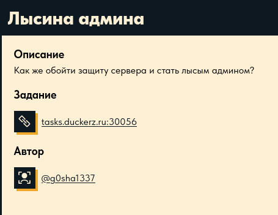
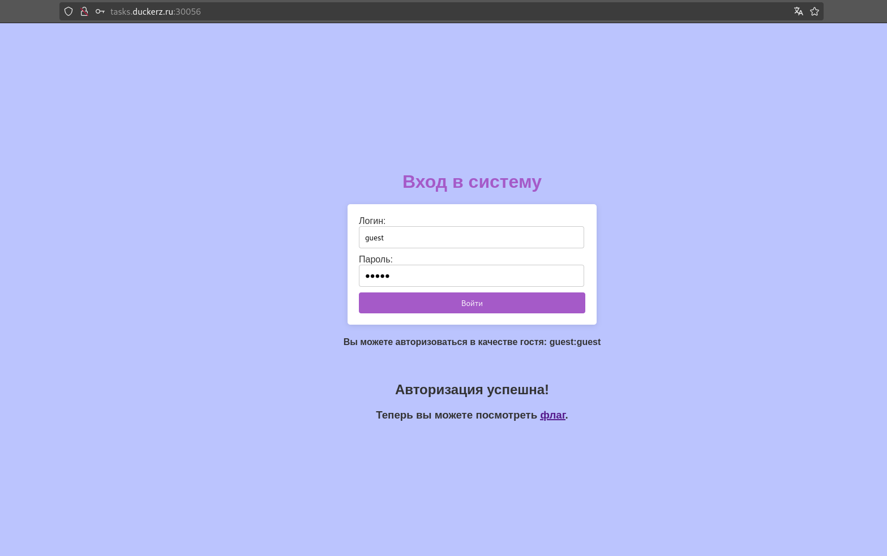
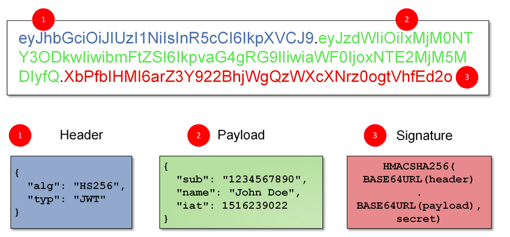
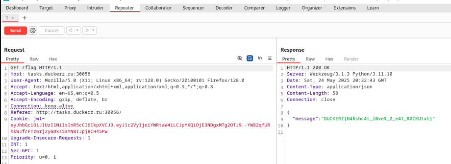

# Bald Admin

Выберите язык / Choose your language:

- 🇷🇺 [Русский](README.md)  
- 🇬🇧 [English](README.en.md)


Today we’re diving into a web task from Duckerz. In order to get the flag, we need to exploit a weak JWT token secret. I’d say this task is relatively simple overall — **if** you ignore the fact that without a little hint from the dev, I’d have been sweating over it WAY longer.

Also decided to start getting into the habit of adding a fix section at the end of my writeups — after all, for the client/employer, the report and the patch matter more than my shenanigans behind the terminal ^^

# Happy reading!

---

# Disclaimer

This writeup was written and translated manually by the author. A language model was used for formatting and stylistic polishing.

This material was prepared solely for educational and research purposes. I do **not** encourage or promote any form of unauthorized access to information systems or violation of applicable laws.

⚠️ **All actions described in this document were performed in a legal research environment (CTF/test platform), without violating any third-party rights or applicable laws.**

Illegal interference with computer systems, mishandling of computer data, or any other form of so-called “black hat” hacking is against the law and goes against the ethics of the infosec community.

I follow the principles of **ethical hacking** and responsible disclosure.

---

# Brief (In russian)



Let’s go!

---

# Step 1

We go to the URL. We’re greeted by a good looking app with guest credentials thoughtfuly shown below:


---

# Step 2

We log in using the guest creds and are met with the following screen:



To retrieve the flag, we need to go to `/flag`. But trying to access it results in nothing:


---

# Step 3

Fired up Burp and started sending requests to `/flag`. I noticed that the cookies contain a JWT token:


I read a bit on this thing called JWT (JavaScript Web Token), and here’s the thing:



The encoding looks super similar to Base64, with a few slight changes — `+` becomes `-`, `/` becomes `_`, and the standard padding of Base64 isn't used.

The token has 3 parts encoded this way and separated by dots (again, this ain’t academic-level precision, just my interpretation in the scope of the task and my experience):

1. Header – service data like the signing algorithm
    
2. Payload – actual data being transmitted
    
3. Signature – the cryptographic piece ensuring the integrity of the token
    

---

# Step 4

Decoded the token using CyberChef:


I guess I am not the only naughty individual who thought of adjusting the `guest` param to `admin`. Sadly for us, the attackers, it’s not that simple. Even if you change the payload, the signature remains — and it was generated using a secret we don’t have.

I also tried changing the `alg` value to `None` (which, if successful, would let you sign a token with literally no signature at all). There are some considerations to bear in mind with that approach, but I didn’t know about them at the time ^^

Sadly, the app wasn’t fooled:


---

# Step 5

Our only real play here is to brute the key. Often, web devs misunderstand how JWTs work and leave in default or weak secrets in the backend.

For bruteforcing the key, we’ll use `hashcat` and a couple of weak JWT secret wordlists.

My mistake was pulling the wrong wordlists from GitHub — ones more focused on generic token bruteforcing rather than the exact one the challenge was built around.

Here they are btw:

- [https://github.com/wallarm/jwt-secrets/blob/master/jwt.secrets.list](https://github.com/wallarm/jwt-secrets/blob/master/jwt.secrets.list)
    
- [https://github.com/buggysolid/bugbounty-wordlist/blob/main/jwt.secrets.list](https://github.com/buggysolid/bugbounty-wordlist/blob/main/jwt.secrets.list)
    
- [https://github.com/ticarpi/jwt_tool/blob/master/jwt-common.txt](https://github.com/ticarpi/jwt_tool/blob/master/jwt-common.txt)
    

Tried all of those, but nothing worked. Then I thought maybe the task's or the app’s name might be a hint to the key. Spoiler: it wasn’t ^^

Dug into the source code and found a clue, which honestly left me more confused than before:


I contacted up the dev of the task and got great feedback. Had a laugh at my own sloppy memory too — the hint was pointing at the classic weak **passwords** list: `rockyou.txt`.

So, cloned the repo containing it:

```bash
git clone https://github.com/danielmiessler/SecLists.git
```

Then we run the following `hashcat` command:

```bash
hashcat -a 0 -m 16500 <token> <wordlist>
```

This flag sets hashcat to dictionary attack mode:

```bash
-a 0
```

And this one tells it we’re dealing with a JWT hash:

```bash
-m 16500
```

Eventually, we get the key (I added `--show` since this wasn’t my first run):


---

# Step 6

Almost done — time to craft our own payload and sign the token:


---

# Step 7

We send the forged token and receive a response from the server with the flag:



---

# Fix

Since the server rejected both unsigned tokens and tokens with a tampered payload, signature verification is clearly in place. The only viable fix here: replace the key with a **strong, cryptographically secure one**, and make sure it doesnt appear in any common JWT wordlists.

---

# Tools Used

1) BurpSuite 🛠️
2) Hashcat 🐈‍⬛
3) CyberChef 🧑‍🍳

---

# Thanks for reading!