# Лысина Админа

Выберите язык / Choose your language:

- 🇷🇺 [Русский](README.md)  
- 🇬🇧 [English](README.en.md)

Сегодня на разборе веб таска от [Duckerz](https://duckerz.ru/). Чтобы получить флаг необходимо проэкспуалатировать уязвимость слабого ключа JWT токена. Я считаю таску можно в целом назвать относительно несложной, если исключить тот факт, что если бы не маленькая хинта от разработчика, то пыхтел бы я над ней НАМНОГО дольше.

Решил так же потихоньку вводить привычку писать в конце райтапов способы устранения использованной в ходе решения уязвимости. Как никак главное для заказчика/начальника - репорт и фикс, а не мои выкрутасы за терминалом ^^

# Приятного чтения!

---

# Дисклеймер


Текст написан и переведён автором вручную. Для форматирования и стилистической правки использовалась языковая модель.

Данный материал подготовлен исключительно в образовательных и исследовательских целях. Я не поощряю и не призываю к осуществлению неправомерного доступа к информационным системам, нарушению законодательства.

⚠️ **Все действия, описанные в данном документе, производились в рамках разрешённой исследовательской среды (CTF/тестовая платформа), без нарушения прав третьих лиц и действующего законодательства.**

Незаконное вмешательство в работу компьютерных систем, нарушение правил хранения и обработки компьютерной информации, а также иные формы так называемого "чёрного" хакерства противоречат закону и этике информационной безопасности.

Я придерживаюсь принципов **этичного хакинга** и ответственного раскрытия уязвимостей.


# Бриф

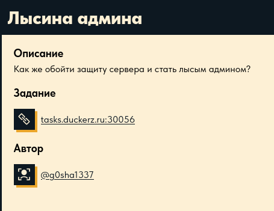

Погнали решать

---

# Шаг 1

Переходим по урле. Нас встречает симпатичное на вид приложение с гостевыми кредами, заботливо указанными ниже:

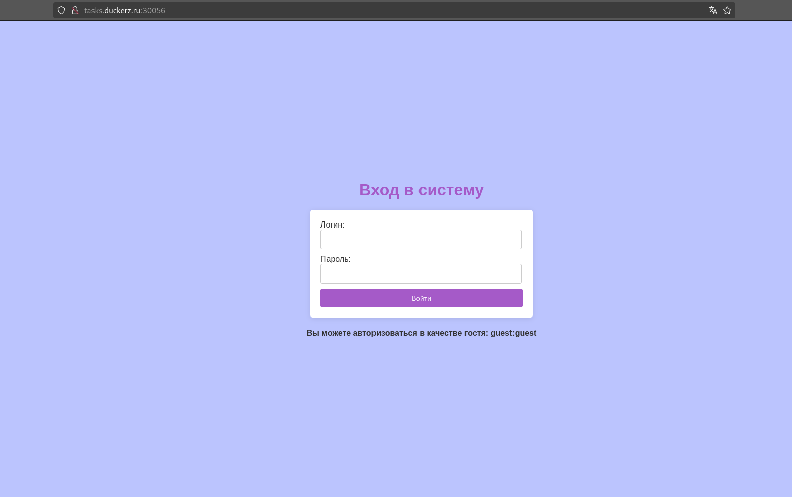

---

# Шаг 2

Регаемся по гостевым данным, наблюдаем следующюю картину:

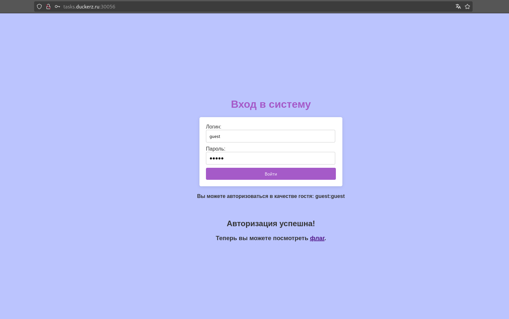

Чтобы залутать флаг, необходимо перейти в `/flag`. Однако при попытке перехода упираемся в стену:

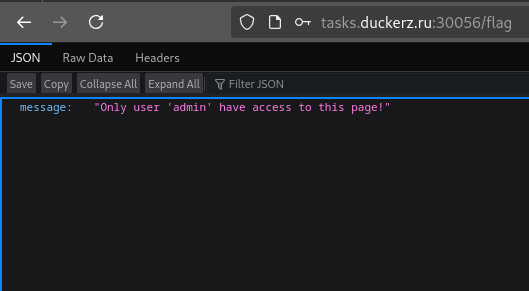

---

# Шаг 3

Через бурпу начал делать повторные запросы на `/flag`, увидел, что в куках передается JWT токен:

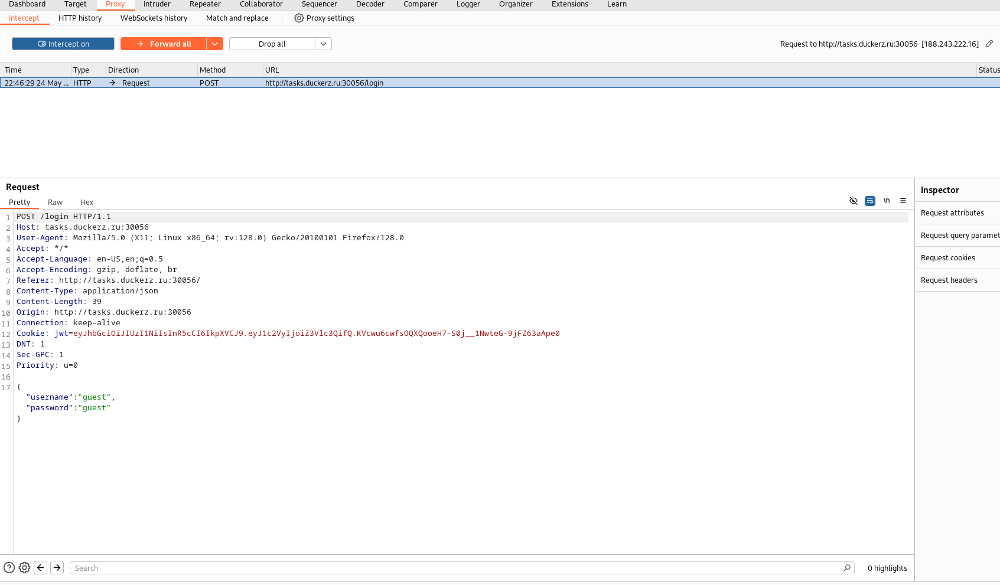

Почитал про этот ваш JWT (JavaScript Web Token), соль в чём:

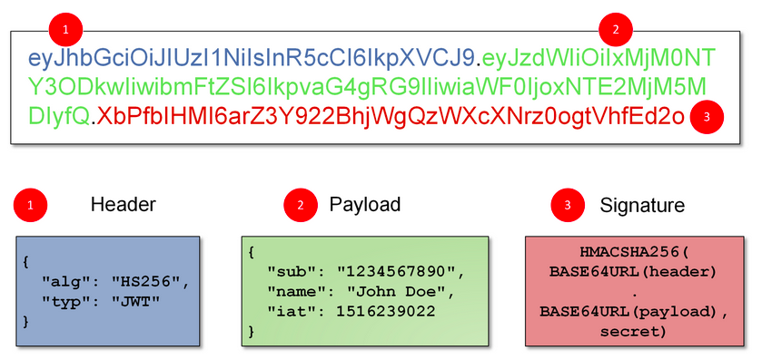

Алгоритм крайне похож на Base64, с той лишь разницей, что заменили символы `+` на `-`, а `/` на `_`, и убрали стандартный паддинг.

Токен состоит из трёх закодированных по данной схеме частей, разделенных точкой (не академически точные пояснения, даны исключительно в скоупе задачи и моей интерпритации):

1) Header - служебная инфа, включающая в себя такую информацию как используемый алгоритм подписи  
2) Payload - непосредственно данные, которые передаются  
3) Signature - подпись, обеспечивающая криптографическую целостность данных

---

# Шаг 4

Декодирую токен, закинув его в кибершеф:


Наверняка не одному мне закралась в голову мысль слегка пошалить, изменив параметр `guest`, присвоив ему значение `admin`. К сожалению для атакующего, не всё так просто, как хотелось бы. Даже если поменять параметр на другое значние, останется подпись, взятая от предыдущих данных и ключа, доступа к которому не имеем.

У меня так же не получилось подменить и значение параметра `alg` на `None` (При удачной атаке токен бы не подписывался, и в него можно было бы закодировать любые данные и отправить). Есть нюансы у такого метода, но тогда я ещё о них не знал ^^

К сожалению, ответ от приложения в обоих случаях непоколебим:

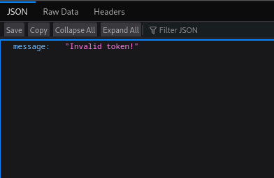

---

# Шаг 5

Справедливо сказать, что наш единственный выход - похекать ключ. Зачастую девелоперы веб приложений неправильно понимают концепцию JWT токенов, и оставляют дефолтные или популярные ключи в бэкенде для подписи. В переборе нам поможет утилита `hashcat` и пара-тройка словарей с слабыми ключами.

Моя ошибка была лишь в том, что я стягивал с гитхаба не те словари, по которым должен был ломать ключ по задумке создателя таски, а специализированные подборки для поиска уязвимостей в токенах.

Вот ссылки кстати:

- https://github.com/wallarm/jwt-secrets/blob/master/jwt.secrets.list  
- https://github.com/buggysolid/bugbounty-wordlist/blob/main/jwt.secrets.list  
- https://github.com/ticarpi/jwt_tool/blob/master/jwt-common.txt

Попробовал все найденные словари, но ничего из этого не вышло. Начал было думать, как название задачи и приложения в целом может помочь в поиске ключа. Спойлер - никак ^^

Покопавшись в сурцах нашёл, подсказку, которая ввела меня в еще больший ступор если честно:

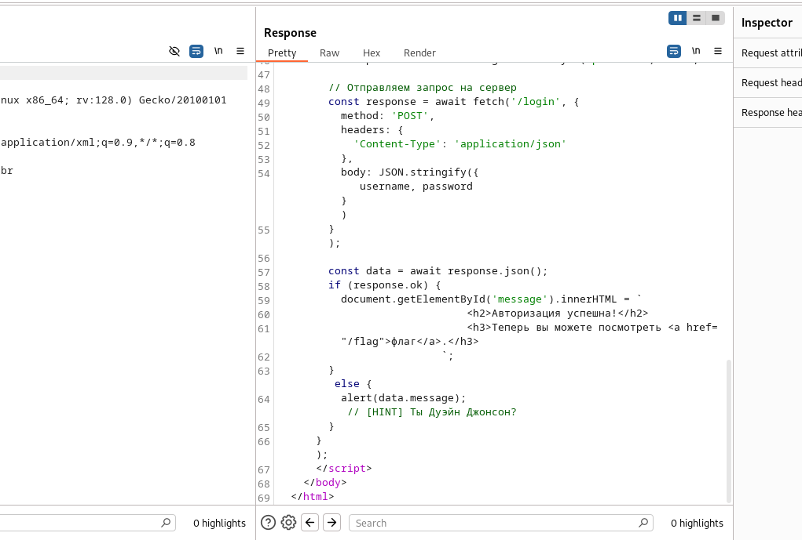

Связавшись с разрабом таски и получив от него очень хорошую обратную связь, немного даже угарнул с своей забывчивости. Намёк был на популярный в кругах безопасников файлик с слабыми ***паролями*** `rockyou.txt`.

Клонируем репу, в которой содержится этот словарь:

```bash
git clone https://github.com/danielmiessler/SecLists.git
```

Прописываем команду для `hashcat` вида:

```bash
hashcat -a 0 -m 16500 <токен> <словарь>
```

Этот флаг переводит тулзу в режим атаки по словарю:

```bash
-a 0
```

А этот поясняет, что хэш от JWT-шки:

```bash
-m 16500
```

Как итог, получаем ключ (добавил флажок `--show` тк запускаю инструмент не в первый раз):

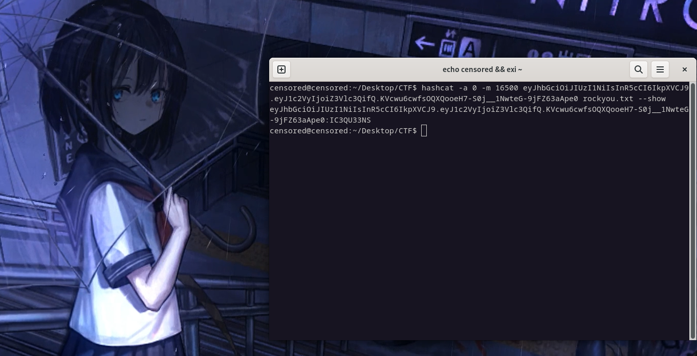


---

# Шаг 6

Дело за малым - отсалось сконстурировать собственный пэйлоуд и подписать токен:

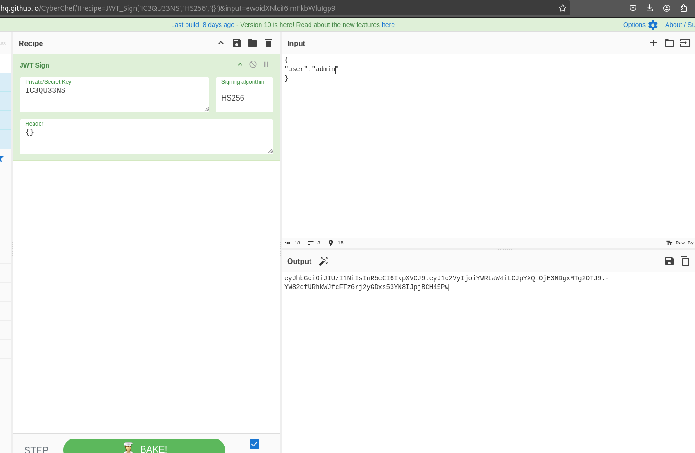

---

# Шаг 7

Отправляем подделанный токен, получаем ответ от сервера с флагом:

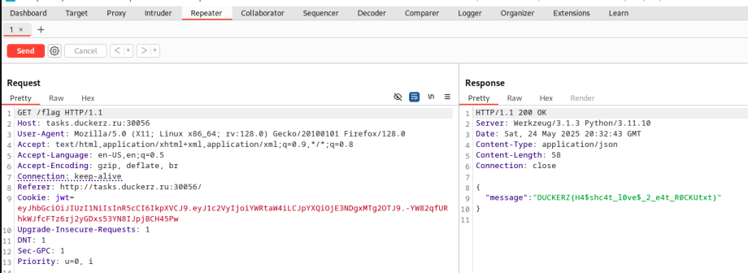

---

# Фикс

Поскольку я безуспешно отправлял на сервер как неподписанные токены так и токены с поддельным пейлоудом, скорее всего проверка на целостность и соответствие подписи имеется. Единственное решение, которое мне приходит в голову - поменять ключ на криптостойкий, предварительно проверив его наличие в списках для атак по словарю.

---

# Использованные инструменты

1) BurpSuite 🛠️
2) Hashcat 🐈‍⬛
3) CyberChef 🧑‍🍳

---

# Всем спасибо за внимание!