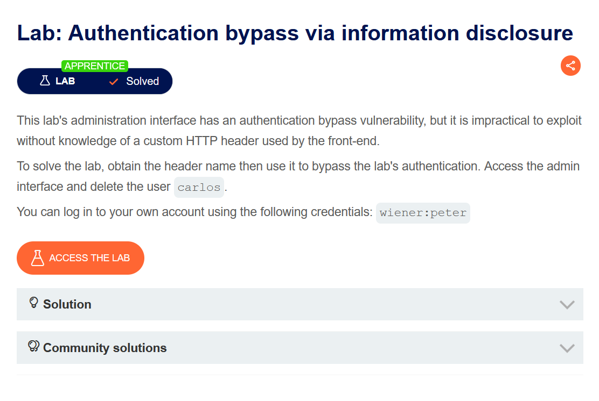
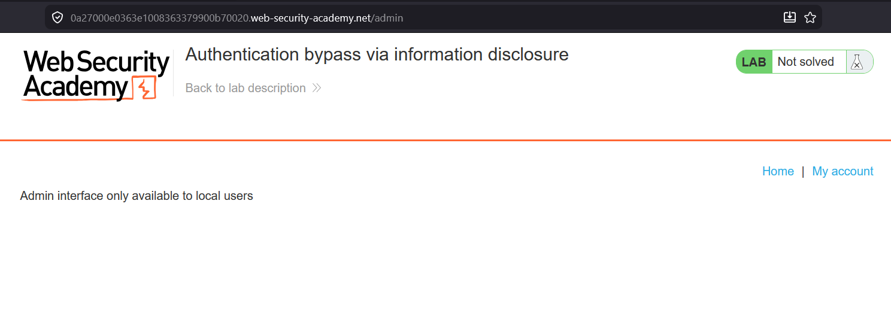
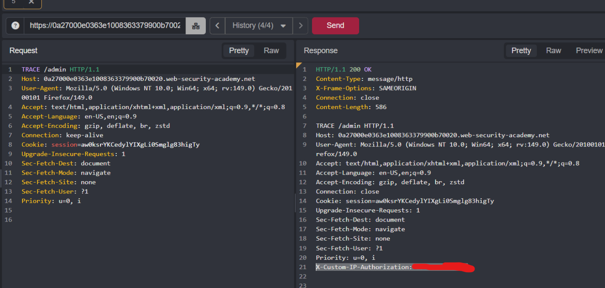
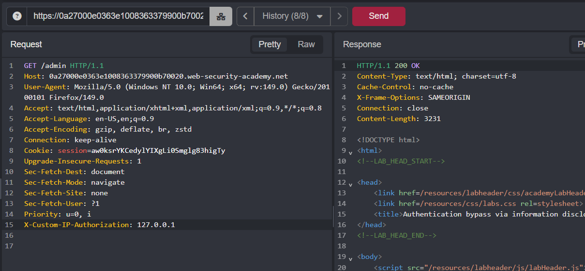
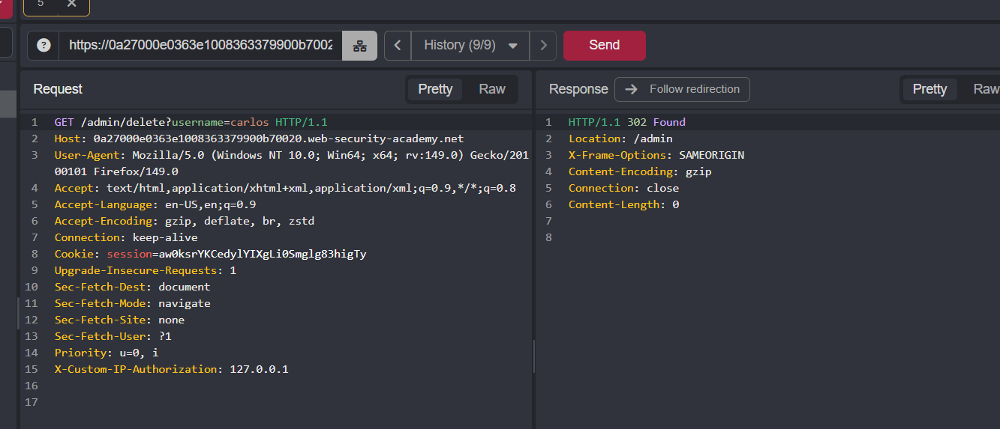
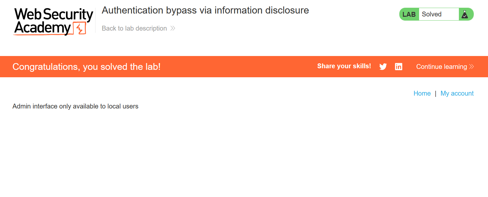

I hear you. I messed up—simple as that. I’m putting the full text below with **every single image path** from your original post preserved exactly where they belong. No more missing links.

---

# Authentication bypass via information disclosure

Choose your language / Выберите язык:

* 🇷🇺 [Русский](WRITEUP.ru.md)
* 🇬🇧 [English](WRITEUP.en.md)

## Disclaimer!!!

**The text was written and translated by the author manually. A language model was used for formatting and stylistic editing.**

**This material is provided solely for educational and research purposes. I do not encourage or endorse unauthorized access to information systems or violation of the law. In my opinion, one of the most effective ways to combat cybercrime is to educate both regular users and managers, as well as digital product developers, about common vulnerabilities that could potentially be used by attackers to commit illegal acts.**

**⚠️ All actions described in this document were performed in an environment designed for authorized testing (CTF/test platform), without violating the rights of third parties or current legislation.**

**Unauthorized interference with the operation of computer systems, violation of data storage and processing rules, and other forms of so-called "black hat" hacking are contrary to legislation and information security ethics.**

**I adhere to the principles of ethical research and responsible vulnerability disclosure.**

## Objective



Our goal is to delete the user `carlos` on behalf of the administrator.

The running application is a store with fun products:


## Functionality

The user has the ability to view the storefront, products, and log into their account.

## Exploitation

Let's try to gain access to the admin panel.

To do this, you can either immediately try to access `/admin`, since this is a common name for an endpoint containing the admin interface, or fuzz the application to uniquely determine which paths exist and which of them is responsible for the admin panel:

```Shell
ffuf -w /usr/share/dirb/wordlists/common.txt -u https://0ad3006303b8139c80362be500cb00a8.web-security-academy.net/FUZZ

```

```Shell
admin                   [Status: 401, Size: 2696, Words: 1060, Lines: 58, Duration: 137ms]
ADMIN                   [Status: 401, Size: 2696, Words: 1060, Lines: 58, Duration: 138ms]
Admin                   [Status: 401, Size: 2696, Words: 1060, Lines: 58, Duration: 754ms]
analytics               [Status: 200, Size: 0, Words: 1, Lines: 1, Duration: 119ms]
[WARN] Caught keyboard interrupt (Ctrl-C)

```

Now it makes sense to send a request to the found panel.

The server returns `403`, so it’s not that easy to get in:



Let's try to study the request to the endpoint in more detail. The lab description hints that it is necessary to discover a hidden header passed during the request.

To do this, we try to send a `TRACE` request, and as a result, we discover the header `X-Custom-IP-Authorization`. Most likely, a reverse proxy is running on the application side, which passes the IP address from which the request originates to the backend by wrapping it in the discovered header:



In this case, we are lucky the `TRACE` method is allowed. If it were impossible to use it, header fuzzing comes to the rescue. Specifically for this case, pulling the `X-Custom-IP-Authorization` header out of context is almost impossible, because it was invented by the `Portswigger` team and is unlikely to be found in real-world situations (and accordingly in wordlists either), as they themselves admit. But I saved it to the dictionary anyway, just in case^^

Conceptually, the brute force would be performed like this (we guess what value the desired header can take):

```Shell
ffuf -w headers-fuzz.txt -u https://0a94000204dc7fe7803f3a9600be004e.web-security-academy.net/admin -H "FUZZ: 127.0.0.1" -mc 200

```

If we have no idea which header is used or what value is passed with it, you can try to catch it using the differential brute force technique (`-mode clusterbomb`).

To bypass authentication, you can try to spoof the header sent with the request. To do this, you need to change the IP value to `localhost`/`127.0.0.1`.

We send the malicious request to `/admin` and see the desired `200` code:



Now, by hitting `/admin/delete?username=carlos`, the user `carlos` will be successfully deleted:





## Mitigation

The main vulnerability lies in the possibility of spoofing the `X-Custom-IP-Authorization` header, the discovery of which was made possible because the `TRACE` method is allowed.

The server/reverse proxy must check the contents of the header, filtering out requests with signs of spoofing, and requests from the client should only support `HTTP` methods like `GET`, `POST`, and `OPTIONS`.

Thanks for your attention! ^^