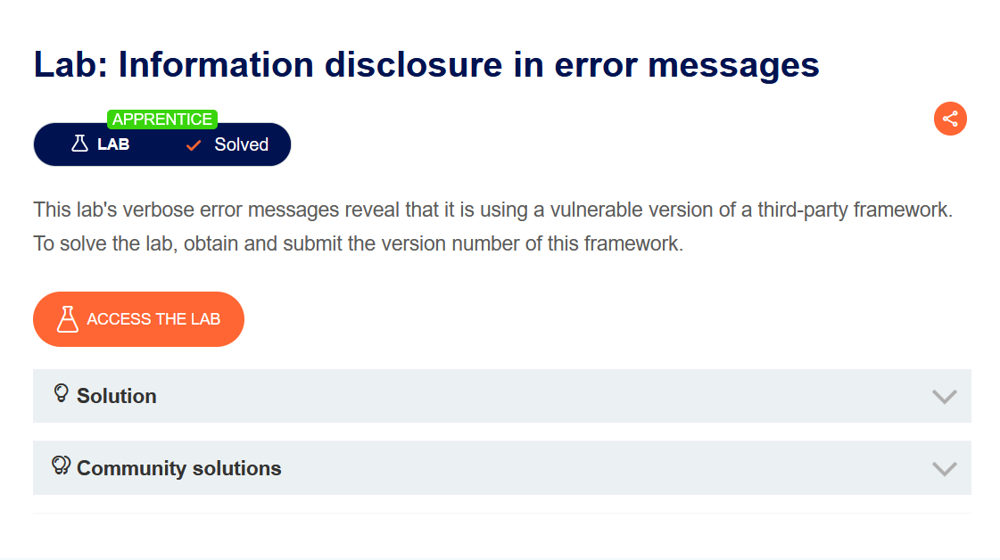
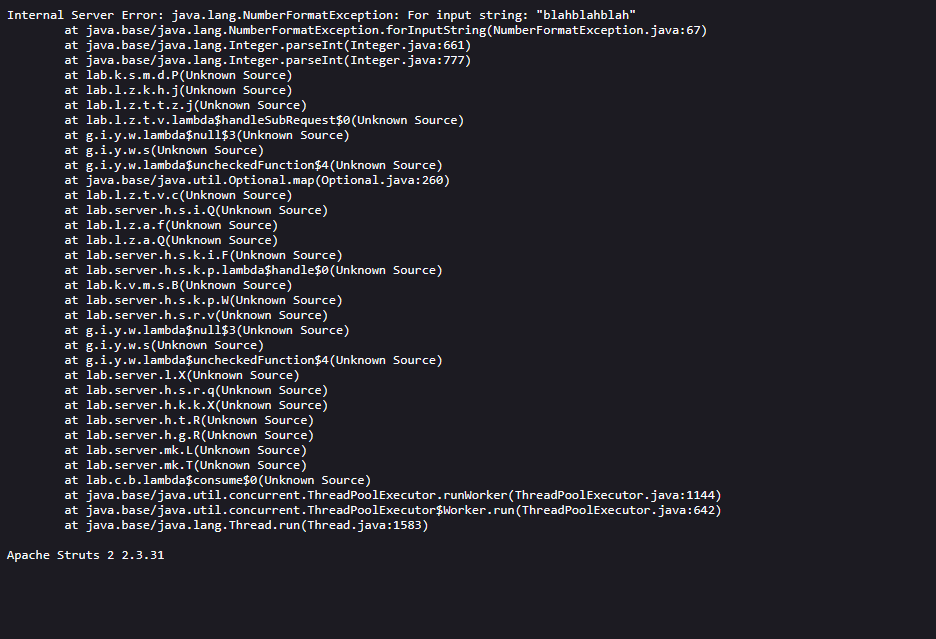

# Information disclosure in error messages

Выберите язык / Choose your language:

- 🇷🇺 [Русский](WRITEUP.ru.md)
- 🇬🇧 [English](WRITEUP.en.md)

## Дисклеймер!!!

**Текст был написан и переведен автором вручную. Языковая модель использовалась для форматирования и стилистического редактирования.**

**Данный материал предоставлен исключительно в образовательных и исследовательских целях. Я не призываю и не одобряю несанкционированный доступ к информационным системам или нарушение закона. По моему мнению, одним из наиболее эффективных способов борьбы с киберпреступностью является просвещение как обычных пользователей и руководителей, так и разработчиков цифровых продуктов о распространенных уязвимостях, которые потенциально могут быть использованы злоумышленниками для совершения противоправных действий.**

**⚠️ Все действия, описанные в данном документе, были выполнены в среде, предназначенной для авторизованного тестирования (CTF/тестовая платформа), без нарушения прав третьих лиц или действующего законодательства.**

**Несанкционированное вмешательство в работу компьютерных систем, нарушение правил хранения и обработки данных и другие формы так называемого "черного" хакерства противоречат законодательству и этике информационной безопасности.**

**Я придерживаюсь принципов этичных исследований и ответственного раскрытия уязвимостей.**

## Цель



Судя по брифу необходимо спровоцировать ошибку приложения, и выяснить версию фреймворка под его капотом.

Запустив инстанс увидим веб магазин с забавными товарами:


## Функционал

Пользователю доступна функция просмотра товаров, которые возвращаются с помощью параметра `productID`:


## Эксплуатация

Параметр `productID` вероятнее всего ожидает на вход целочисленное значение, поэтому попробуем вызвать ошибку приложения, передав на него неожиданный ввод:

``` Shell
https://LAB_ID?productID=blahblahblah
```

В результате вывелась ошибка, которая раскрывает много информацию про бэкенд:



Интересующие нас данные - `Apache Struts 2 2.3.31`. Раскрытие этих данных опасно, т.к позволяет атакующему расширить attack-surface через поиск релевантных CVE, в качестве примера к упомянутой версии Apache Struts - `CVE-2017-5638`.
    
С помощью кнопки `Submit Solution` сдаем "флаг", решая лабу:


## Противодействие

В случае, если при работе приложения возникают ошибки, их необходимо рейзить локально, и ни в коем случае не допускать рендеринг этих сообщений на стороне пользователя

Спасибо за внимание! ^^