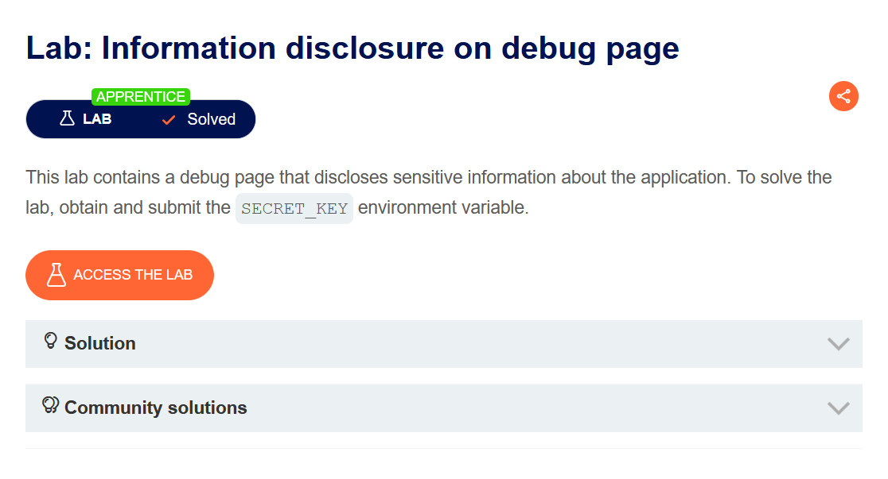
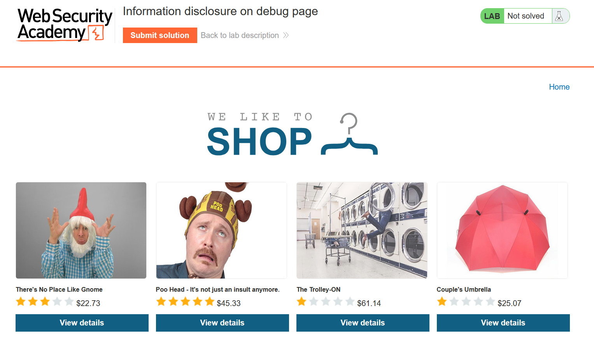
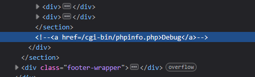
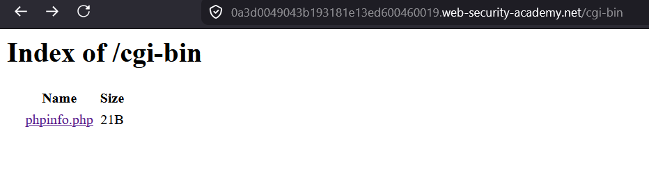
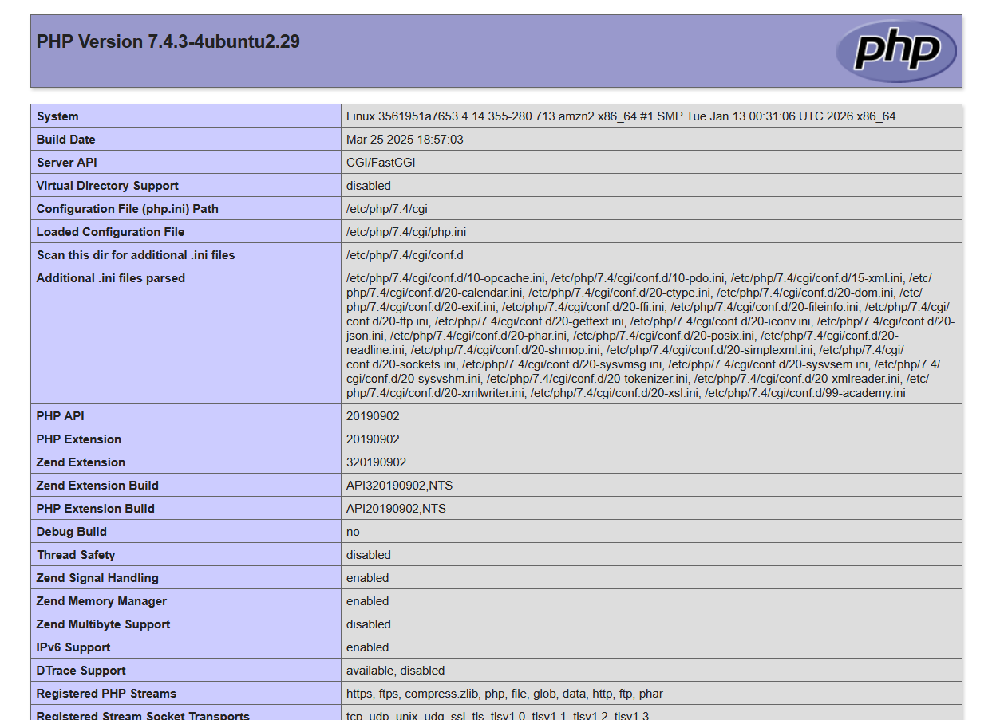
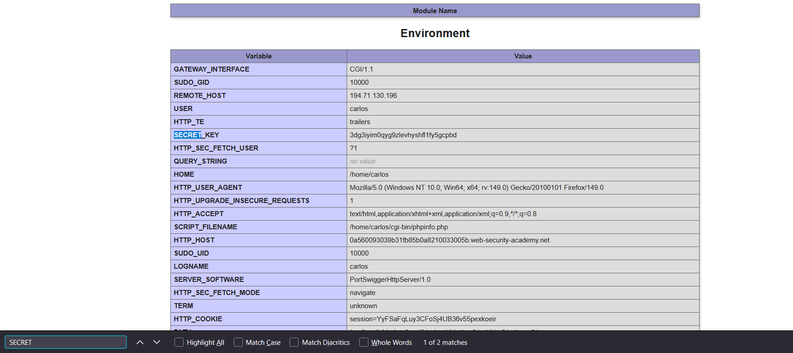
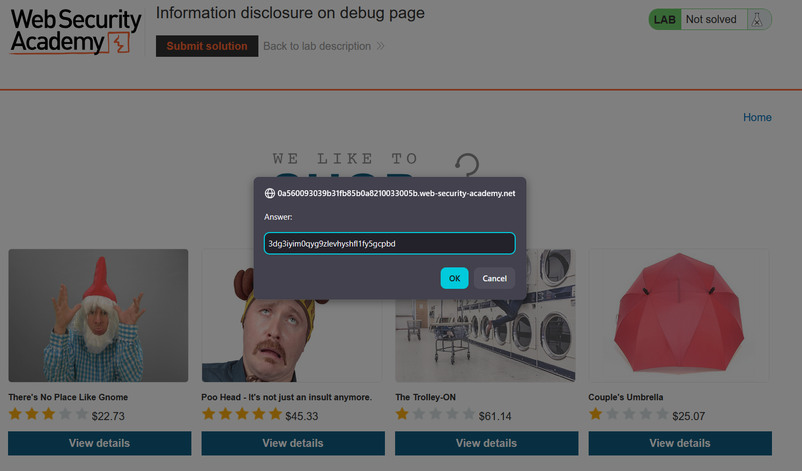
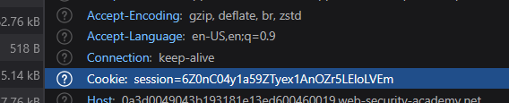

# Information disclosure in error messages

Выберите язык / Choose your language:

- 🇷🇺 [Русский](WRITEUP.ru.md.md)
- 🇬🇧 [English](WRITEUP.en.md.md)

## Дисклеймер!!!

**Текст был написан и переведен автором вручную. Языковая модель использовалась для форматирования и стилистического редактирования.**

**Данный материал предоставлен исключительно в образовательных и исследовательских целях. Я не призываю и не одобряю несанкционированный доступ к информационным системам или нарушение закона. По моему мнению, одним из наиболее эффективных способов борьбы с киберпреступностью является просвещение как обычных пользователей и руководителей, так и разработчиков цифровых продуктов о распространенных уязвимостях, которые потенциально могут быть использованы злоумышленниками для совершения противоправных действий.**

**⚠️ Все действия, описанные в данном документе, были выполнены в среде, предназначенной для авторизованного тестирования (CTF/тестовая платформа), без нарушения прав третьих лиц или действующего законодательства.**

**Несанкционированное вмешательство в работу компьютерных систем, нарушение правил хранения и обработки данных и другие формы так называемого "черного" хакерства противоречат законодательству и этике информационной безопасности.**

**Я придерживаюсь принципов этичных исследований и ответственного раскрытия уязвимостей.**

## Цель



Ого! возможно, будем фаззить^^

Запущенное приложение - магазин с забавными товарами



## Функционал

Пользователю доступна функция просмотра витрины и товаров, но судя по брифу, дело будем иметь с эндпойнтом `debug`, поэтому в данном случае нас функционал не сильно интересует.
## Эксплуатация

Конкретно в данном кейсе, существует всего три способа обнаружить страницу `debug`:
### Изучение исходников

 Покопавшись в девтулзах, можно легко найти интересующий нас путь:
 


### Фаззинг

Фаззер с дефолтным словарем подцепит этот путь, т.к он часто встречается для легаси `CGI` конфигураций:

``` Shell
dirb https://0a3d0049043b193181e13ed600460019.web-security-academy.net
```

``` Shell
---- Scanning URL: https://0a3d0049043b193181e13ed600460019.web-securityacademy.net/ ----
	+ https://0a3d0049043b193181e13ed600460019.web-security-academy.net/analytics (CODE:200|SIZE:0)
	+ https://0a3d0049043b193181e13ed600460019.web-security-academy.net/cgi-bin (CODE:200|SIZE:410)
	+ https://0a3d0049043b193181e13ed600460019.web-security-academy.net/cgi-bin/ (CODE:200|SIZE:410)
	+ https://0a3d0049043b193181e13ed600460019.web-security-academy.net/favicon.ico (CODE:200|SIZE:15406)
	+ https://0a3d0049043b193181e13ed600460019.web-security-academy.net/filter (CODE:200|SIZE:11134)
	+ https://0a3d0049043b193181e13ed600460019.web-security-academy.net/product (CODE:400|SIZE:30)
```

В данном кейсе `dirb` не смог рекурсивно подцепить `phpinfo.php`, однако этот файл можно обнаружить, перейдя по идентифицированному  пути `/cgi-bin`:



Или же можно профаззить конкретно `/cgi-bin`:

``` Shell
---- Scanning URL: https://0a3d0049043b193181e13ed600460019.web-security-academy.net/cgi-bin/ ----
	+ https://0a3d0049043b193181e13ed600460019.web-security-academy.net/cgi-bin/phpinfo.php (CODE:200|SIZE:69811)
```

После идентификации валидного эндпойнта, можно перейти по нему:



 Это самая настоящая кладезь информации о приложении! Найдем поле `SECRET_KEY`:



Сабмитим его: 



И получаем приятное сообщении об успешном решении лабы: 


## Противодействие

Кейс, при котором множество служебных эндпойнтов торчат наружу - серьезная угроза безопасности, т.к снабжает атакующего ценными сведениями для расширения attack surface.

 В случае если по какой то причине этот эндпойнт нужен, защита от данной уязвимости - возвращать `403` всем "смертным" пользователям, пытающимся достучаться как до `/cgi-bin/`, так и до любого его содержимого (чтобы не допустить Broken Access Control). В контексте данной лабы эта имплементация возможно, т.к передаются куки токены:



А лучше - просто не деплоить страницы для дебага^^

Спасибо за внимание! ^^