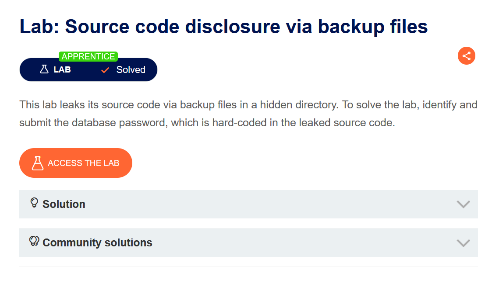
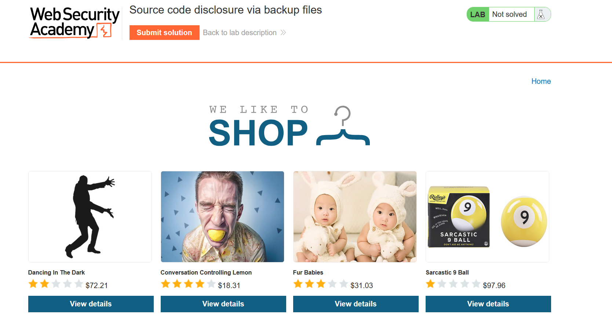
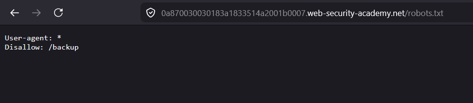
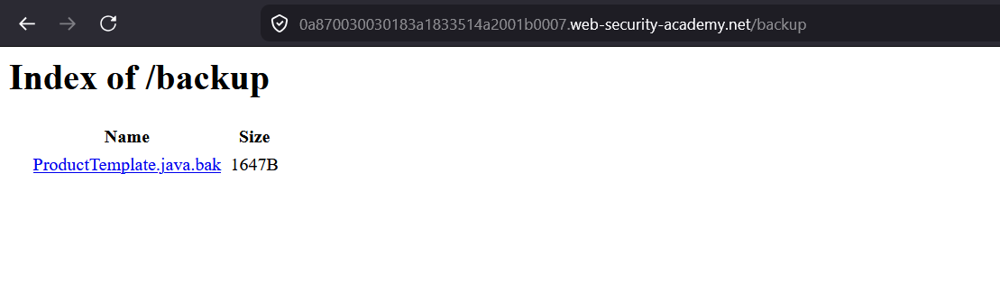
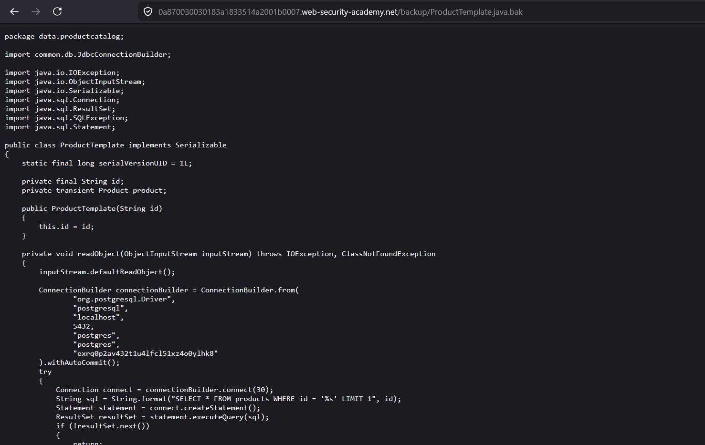
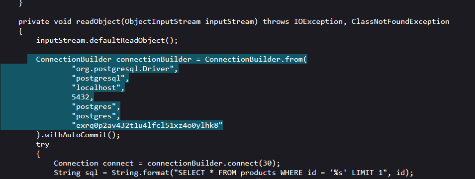
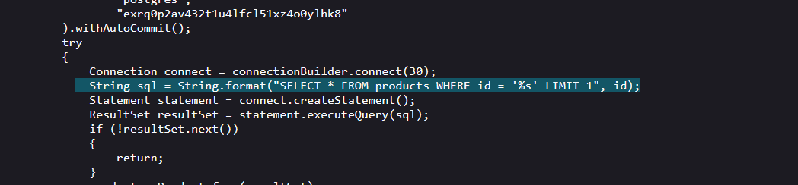
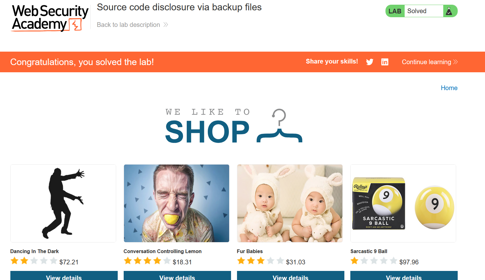

# Information disclosure on debug page

Choose your language / Выберите язык:

* 🇷🇺 [Русский](WRITEUP.ru.md)
* 🇬🇧 [English](WRITEUP.en.md)

## Disclaimer!!!

**The text was written and translated by the author manually. A language model was used for formatting and stylistic editing.**

**This material is provided solely for educational and research purposes. I do not encourage or endorse unauthorized access to information systems or violation of the law. In my opinion, one of the most effective ways to combat cybercrime is to educate both regular users and managers, as well as digital product developers, about common vulnerabilities that could potentially be used by attackers to commit illegal acts.**

**⚠️ All actions described in this document were performed in an environment designed for authorized testing (CTF/test platform), without violating the rights of third parties or current legislation.**

**Unauthorized interference with the operation of computer systems, violation of data storage and processing rules, and other forms of so-called "black hat" hacking are contrary to legislation and information security ethics.**

**I adhere to the principles of ethical research and responsible vulnerability disclosure.**

## Objective



The running application is a store with fun products:



## Functionality

The user has the ability to view the storefront and products, but according to the brief, the vulnerability lies in publicly exposed backups, so in this case, the main functionality isn't our primary interest.

## Exploitation

Checking for the presence of `robots.txt` manually is a good habit—and one I forget every single time^^



Its content points to the `/backup` directory, which likely contains the data we are interested in.

By the way, `robots.txt` can be discovered either manually or by catching it with a fuzzer:

```Shell
dirb https://0af40044038d97078823dd00007300f2.web-security-academy.net

```

Output snippet:

```Shell
---- Scanning URL: https://0af40044038d97078823dd00007300f2.web-security-academy.net/ ----
+ https://0af40044038d97078823dd00007300f2.web-security-academy.net/analytics (CODE:200|SIZE:0)
+ https://0af40044038d97078823dd00007300f2.web-security-academy.net/backup (CODE:200|SIZE:435)
+ https://0af40044038d97078823dd00007300f2.web-security-academy.net/favicon.ico (CODE:200|SIZE:15406)
+ https://0af40044038d97078823dd00007300f2.web-security-academy.net/filter (CODE:200|SIZE:11040)

```

The default wordlist finds `/backup` as well—beautiful ^^

Let's check the contents of `/backup`:



We find the following file:



Inside, we find hardcoded credentials:



We also have the opportunity to "admire" the `SQL` query:



Submit the found password to successfully solve the task:



## Mitigation

This vulnerability is easily eliminated—you must never deploy source code or service files along with the application!

Thanks for your attention! ^^