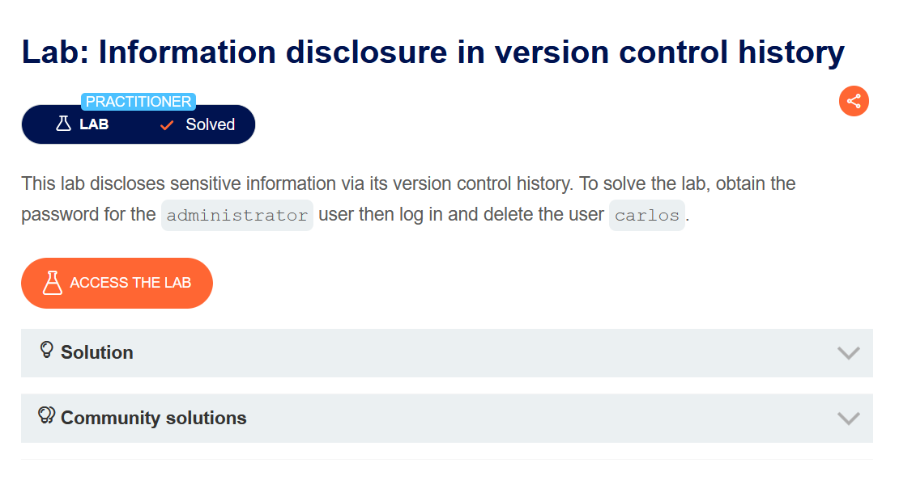
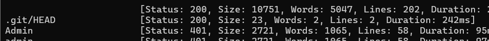
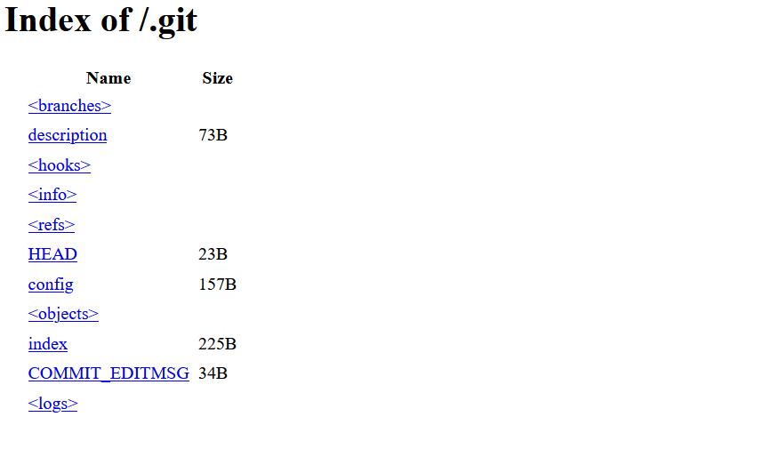
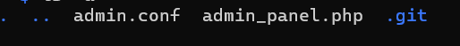
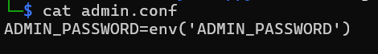
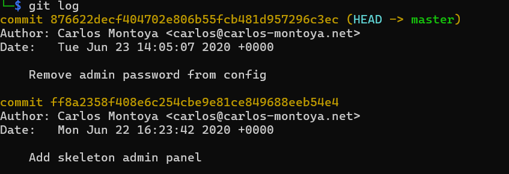
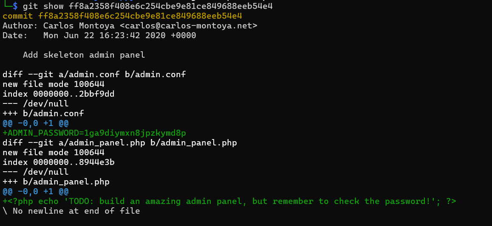
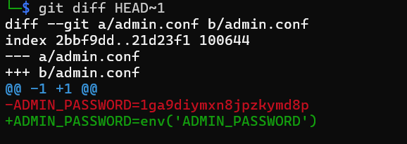
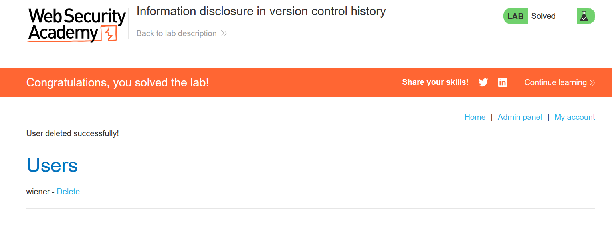

# Information disclosure in version control history

Choose your language:

- 🇷🇺 [Русский](WRITEUP.ru.md)
- 🇬🇧 [English](WRITEUP.en.md)

## Disclaimer!!!

**The text was written and translated by the author manually. A language model was used for formatting and stylistic editing.**

**This material is provided exclusively for educational and research purposes. I do not encourage or condone unauthorized access to information systems or violation of the law. In my opinion, one of the most effective ways to combat cybercrime is to educate ordinary users, managers, and developers of digital products about common vulnerabilities that could potentially be exploited by malicious actors.**

**⚠️ All actions described in this document were performed in an environment designed for authorized testing (CTF/test platform), without violating the rights of third parties or applicable law.**

**Unauthorized interference with computer systems, violation of data storage and processing regulations, and other forms of so-called "black hat" hacking contradict information security law and ethics.**

**I adhere to the principles of ethical research and responsible disclosure of vulnerabilities.**

## Objective



According to the brief, we need to log in under the admin account and delete the user `carlos`.

After launching the instance we can see a web shop with some amusing products:


## Functionality

Users can browse the store and it's products. There is a `/login` endpoint for authentication and `/my-account` for viewing account details.

## Exploitation

Let's fuzz the application to better map out the attack surface:

```shell
ffuf -w <wordlistPath> -u https://<labID>.web-security-academy.net/FUZZ
```

According to the brief we'll be dealing with a version contrl system, which means `/.git` is likely exposed.

And indeed, it showed up:



Let's browse its contents:




The `.git` directory is freely accessible to anyone. This is dangerous. By reading its contents, an attacker can find a lot of information about the source code, request logic, hardcoded credentials, and so on.

Let's try to download the directory using the `git-dumper` utility:

```shell
python3 git_dumper.py https://<labID>.web-security-academy.net/.git ./dumped
```

Or alternatively using `wget`:

```shell
wget -r https://<labID>.web-security-academy.net/.git
```

The result:



Let's try checking the `.conf` file contents. Unfortunately, no hardcoded password was found though:



So let's try examining the differences between files in the commit history:

```shell
git log
```

We can see that only two commits were made:



Let's try viewing information about the first commit:

```shell
git show <commitHash>
```

We can observe that in the old version the administrator password was written directly in the code, and it remained in the commit history despite the code being changed in subsequent versions:



The PortSwigger solution hinted at using `git diff`. This command compares and shows the differences between the current commit (`HEAD`) and the commit preceding it (`HEAD~1`). In the context of this lab this is applicable since there are only two commits, and the issue lies specifically in the first one:

```shell
git diff HEAD~1
```



Now, using the extracted information, we can log in as `administrator`, navigate to the admin panel, and delete the user `carlos`:



## Mitigation

The `.git` service directory must never end up in a production environment. Passwords should not be hardcoded, instead they should be stored in the project's `.env` files, and `.gitignore` should be configured correctly to prevent sensitive data from being committed. In CI/CD pipelines, secret detection tools such as `truffleHog`, `git-secrets`, and others should be used. Any compromised credentials are subject to immediate rotation.

Thank you for your attention! ^^