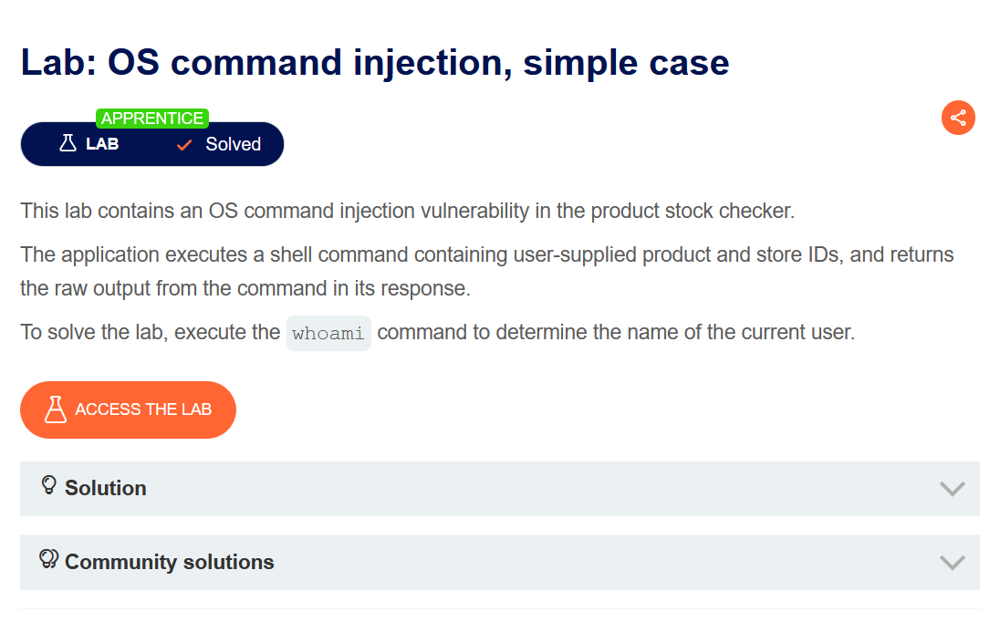
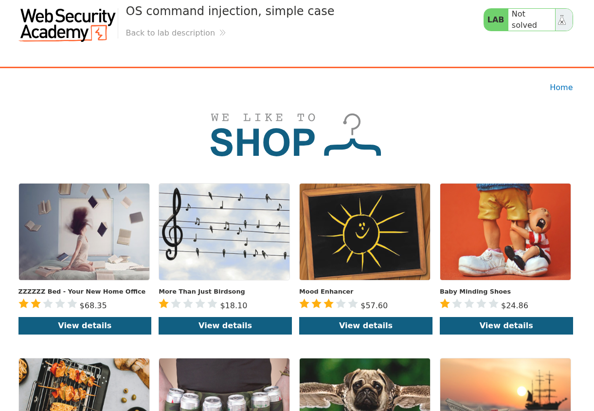
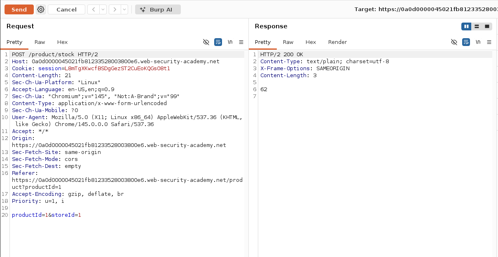
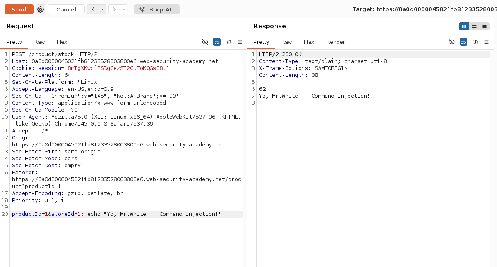
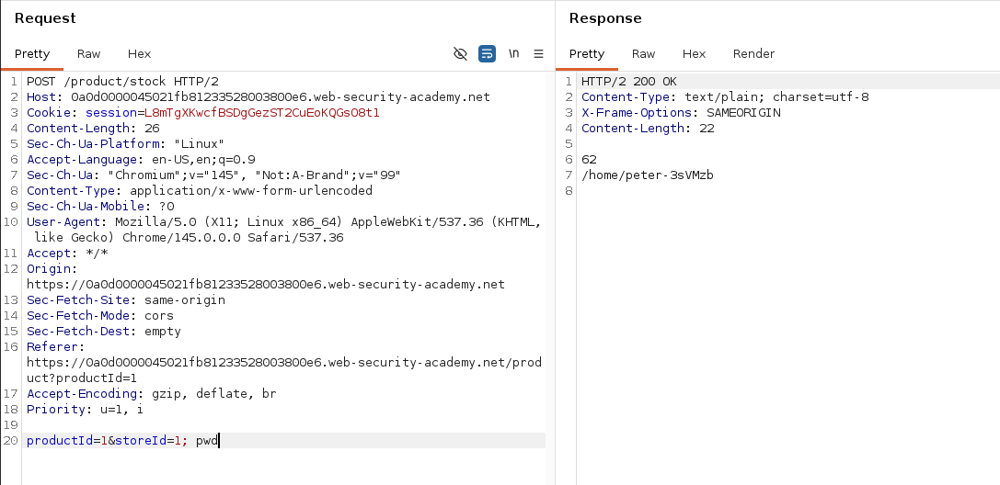
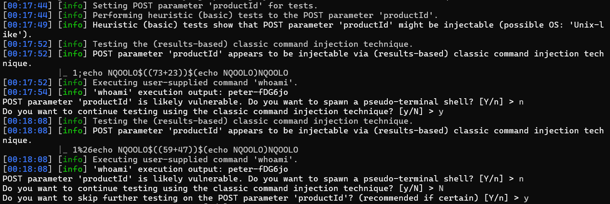
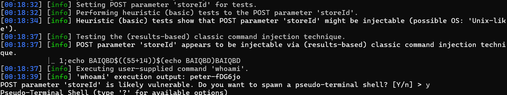
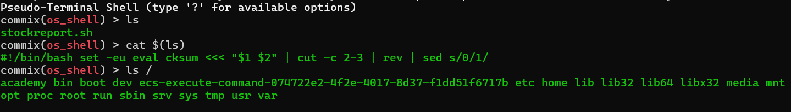
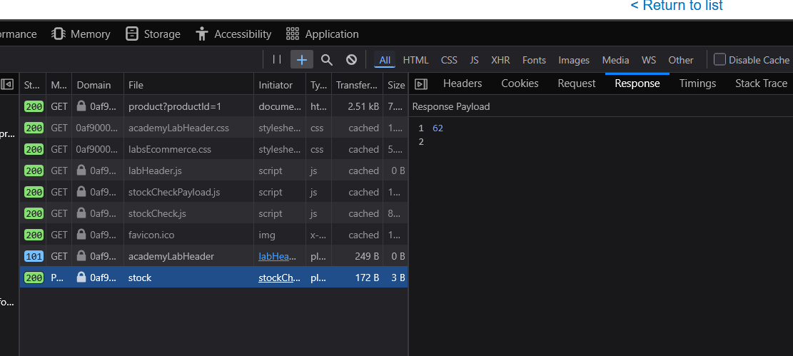
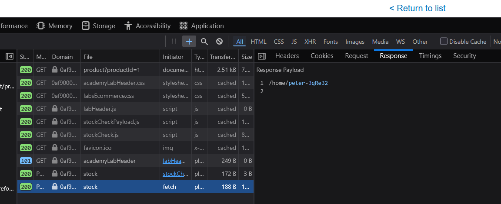

# OS Command injection, simple case

Выберите язык / Choose your language:

- 🇷🇺 [Русский](WRITEUP.ru.md)  
- 🇬🇧 [English](WRITEUP.en.md)

## Дисклеймер

**Текст был написан и переведен автором вручную. Языковая модель использовалась для форматирования и стилистической правки.**

**Данный материал предоставлен исключительно в образовательных и исследовательских целях. Я не призываю и не поощряю несанкционированный доступ к информационным системам или нарушение закона. По моему мнению, одним из наиболее эффективных способов борьбы с киберпреступностью является просвещение как рядовых пользователей и руководителей, так и разработчиков цифровых продуктов о распространенных уязвимостях, которые потенциально могут быть использованы злоумышленниками для совершения противоправных действий.**

**⚠️ Все действия, описанные в этом документе, были выполнены в авторизованной исследовательской среде (CTF/тестовый полигон), без нарушения прав третьих лиц или действующего законодательства.**

**Несанкционированное вмешательство в компьютерные системы, нарушение правил хранения и обработки данных и другие формы так называемого «черного» хакерства противоречат закону и этике информационной безопасности.**

**Я придерживаюсь принципов этичного исследования и ответственного раскрытия уязвимостей.**

## Цель



От нас требуется спровоцировать вызов `whoami`, подтвердив наличие `OS Command Injection`



Запущенное приложение - стандартный портсвиггерский макет онлайн магазина. Товары, как и всегда, довольно забавные^^

## Функционал

Пользователи могут просматривать товары, представленные на витрине, осматривать описание к ним. Так же имеется функция "проверить наличие". По нажатию на кнопку пользователю вернется количество товара, доступного для продажи:


Поскольку нам известен контекст задания, можно сразу переходить к тестированию на `OS Command Injection`, но стоит отметить, что делается исключительно ввиду того, что лаба носит образовательный характер. Вдобавок, нету характерных паттернов поведения приложения, на основании которых можно было бы выдвинуть гипотезу о вероятном зарождении уязвимости (например, видимое участие `Shell` скрипта в обработке данных). В условиях реального пентеста важно оценить весь контекст, прежде чем бомбить приложение пейлоудами.

## Эксплуатация

### Ручное тестирование

Перехватим запрос, идущий на эндпойнт проверки наличия товара (`/product/stock`):



Теперь попробуем вклиниться в логику обработки, например с помощью парцеляции команд символом `;`, и по традиции притворимся Джесси Пинкманом:

``` Shell
productId=1&storeId=1; echo "Yo, Mr.White!!! Command injection!"
```



Сработало! Приложение уязвимо к инъекции команд!

^^


Теперь для выполнения поставленной задачи можно вызвать любую команду ОС, приложение задетектит вызов и отобразит успех:




### Автоматизированное тестирование

Теперь к самому интересному: способ решить лабу, не открывая `BurpSuite`/не редактируя запросы. Для этого расчехлим `commix`.

``` Shell
commix -r request.txt --os-cmd="whoami"
```

С флажком `-r` считываем ввод из текстового файла, в котором лежит `Raw HTTP` запрос, `--os-cmd="whoami"` соответственно выполнит указанную команду, закинув её в следующий пейлоад, сразу после `heuristic` подтверждения уязвимости.

В рамках этой лабы нас не интересуют дополнительные `HTTP` заголовки, и в целях удобства можно сделать так, чтобы `commix` на них не отвлекался:

``` Shell
commix -u "https://instance-link" --data="productId=1&storeId=1" --os-cmd="whoami"
```



Сначала инструмент исследовал параметр `productId`, затем взялся за `storeId`:



И как можно видеть, в обоих случаях `commix` нашел потенциал для раскрутки уязвимости, подобрав работающие пейлоады и проверив себя. И не забыл дополнительно выполнить `whoami`!

По окончанию работы с подбором нагрузок можно вызвать псевдо-шелл (все команды, что будут сюда написаны, будут отправлены на цель, завернутые в пейлоад, а исследователю вернется результат выполнения):



Я решил осмотреться в корневой и текущих директориях, а так же просмотрел содержимое того самого злосчастного скрипта, ответственного за обработку данных:

``` Shell
#!/bin/bash
set -u eval cksum <<< "$1 $2" | cut -c 2-3 | rev | sed s/0/1/
```

Проблема на лицо. В функцию `eval` (преобразует получаемый текст в исполняемый код. Чувствуете чем пахнет, да?^^) прямо подставляются параметры, полученные с запроса, без должной санитизации. Скрипт проливает свет и на то, почему уязвимость можно дергать через оба параметра, а не только через последний (как удобнее всего)

Убедимся в этом наглядно. Вот результат запроса с адекватным значением `productID`:



А вот с измененным, в данном случае я дополнил его вызовом `pwd`:



## Противодействие

Во избежание уязвимостей, связанных с внедрением команд, нельзя допускать прямой конкатенации непроверенного пользовательского ввода в исполняемые строки кода. В идеале, доверять такие операции специальным функциям ЯП, которые гарантированно не смогут вызвать шелл. Механизмы валидации ввода должны отвечать всем стандартам безопасности и не допускать техник обхода ограничений. Процессы такого рода нужно всегда запускать от имени "низкоправного" пользователя. Таким образом, даже если `RCE` и случится, то дальнейшие маневры атакующего будут затруднены.

Спасибо за внимание! ^^