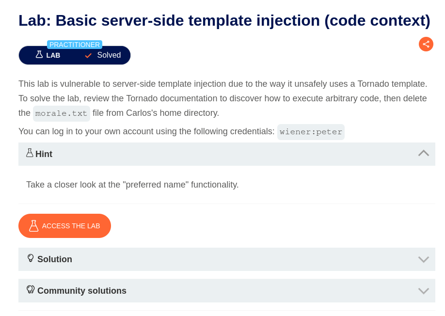
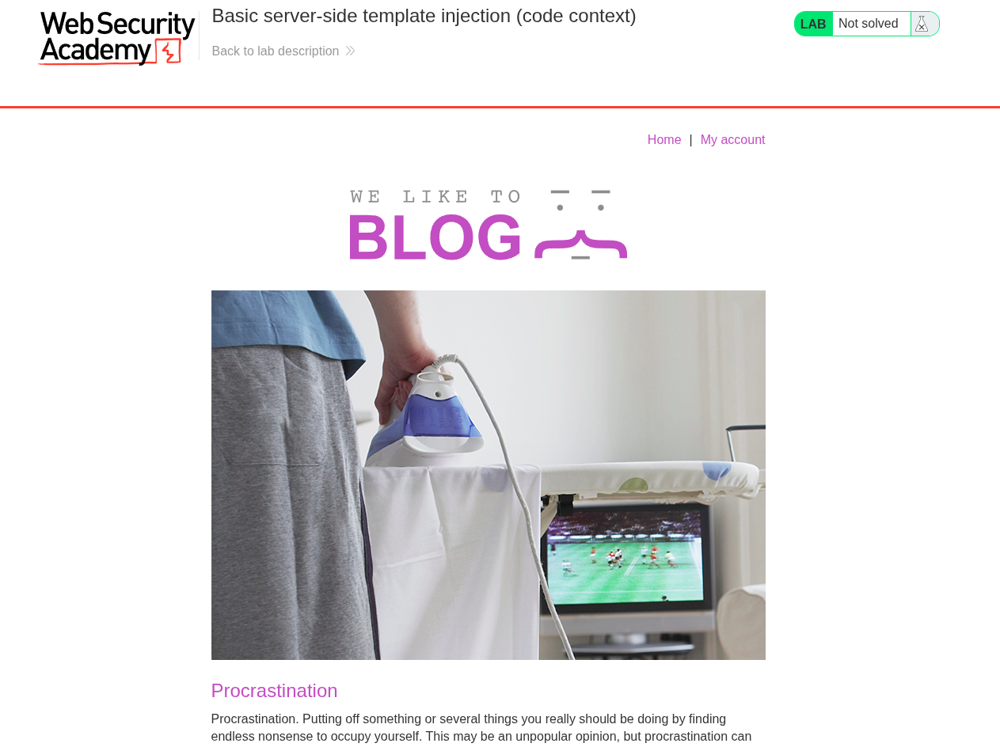
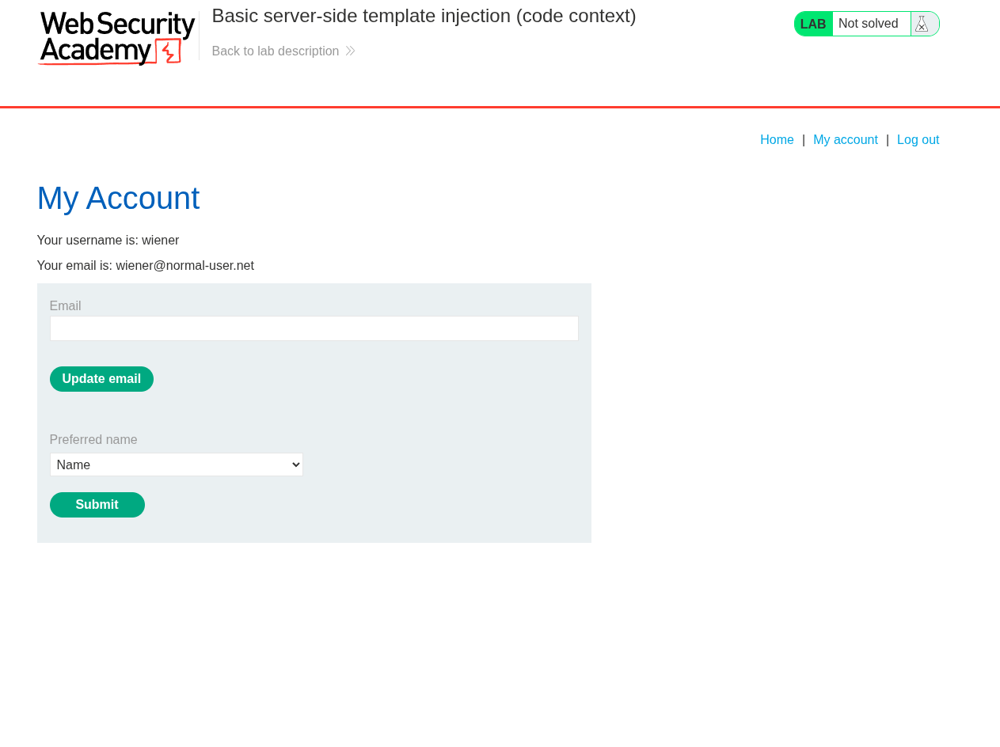
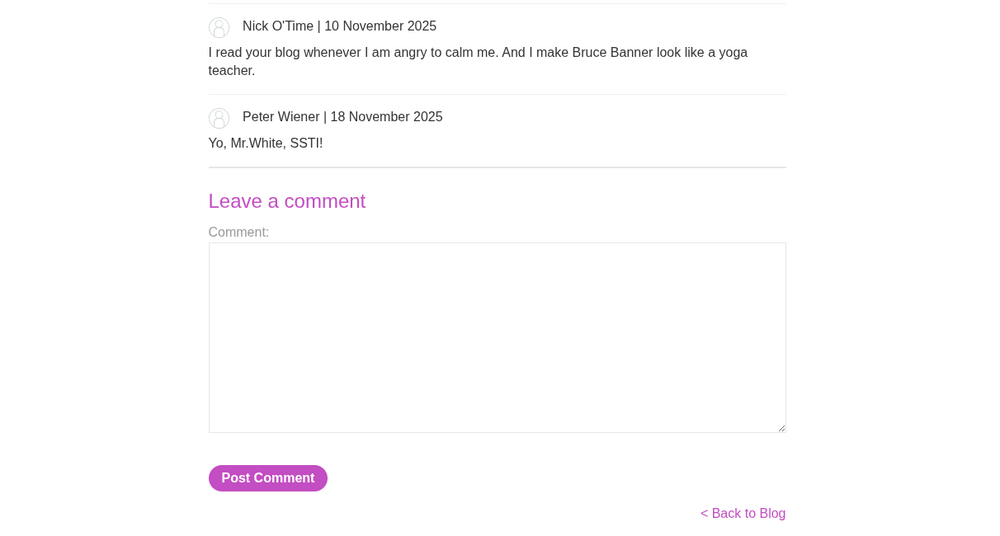
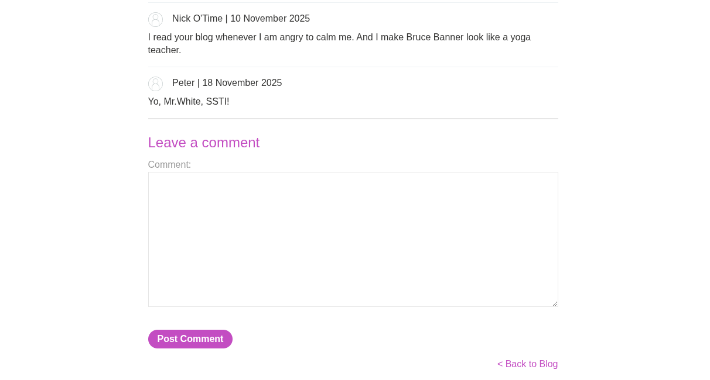
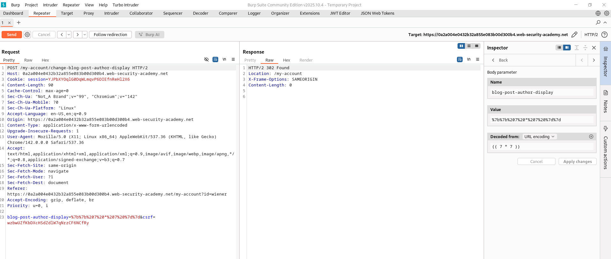
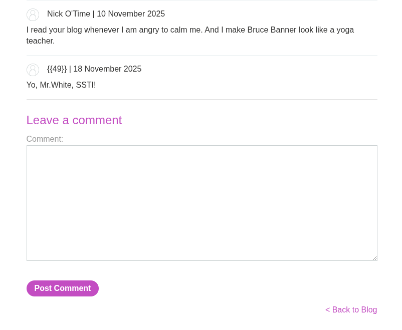
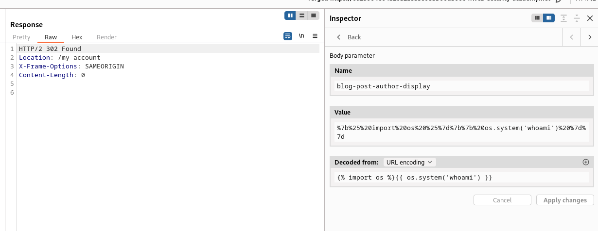
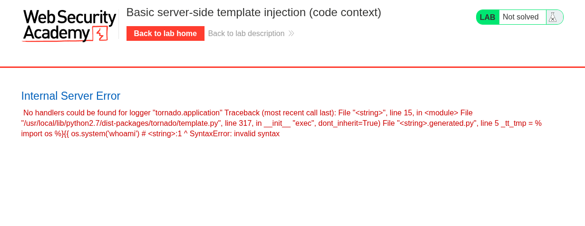

# Basic server-side template injection (code context)

Выберите язык / Choose your language: 
 
- 🇷🇺 [Русский](WRITEUP.ru.md)  
- 🇬🇧 [English](WRITEUP.en.md)

## Дисклеймер
---

**Текст был написан и переведен автором вручную. Языковая модель использовалась для форматирования и стилистического редактирования.**

**Данный материал предоставлен исключительно в образовательных и исследовательских целях. Я не призываю и не одобряю несанкционированный доступ к информационным системам или нарушение закона. По моему мнению, одним из наиболее эффективных способов борьбы с киберпреступностью является просвещение как обычных пользователей и руководителей, так и разработчиков цифровых продуктов о распространенных уязвимостях, которые потенциально могут быть использованы злоумышленниками для совершения противоправных действий.**

**⚠️ Все действия, описанные в данном документе, были выполнены в среде, предназначенной для авторизованного тестирования (CTF/тестовая платформа), без нарушения прав третьих лиц или действующего законодательства.**

**Несанкционированное вмешательство в работу компьютерных систем, нарушение правил хранения и обработки данных и другие формы так называемого "черного" хакерства противоречат законодательству и этике информационной безопасности.**

**Я придерживаюсь принципов этичных исследований и ответственного раскрытия уязвимостей.**

## Цель



Экземпляр приложения выглядит как блог-платформа:



## Функционал

После входа в систему с предоставленными учетными данными можно обнаружить, что, помимо создания комментариев, каждый пользователь может выбрать, как его имя будет отображаться в разделе комментариев (поле `Prefferred name`):



Вот так имя учетной записи будет отображаться по умолчанию:



При выборе опции `Name`:



Наконец, опция `Nickname`:


Выбранные переменные передаются следующим образом:


Все эти факторы являются тревожными симптомами возможной уязвимости `SSTI (Server-Side Template Injection)`! Это требует дальнейшего исследования.

## Эксплуатация

Зная, что приложение использует шаблонизатор `Tornado` на Python (из описания лабораторной работы), можно передавать полезные нагрузки, специфичные для `Tornado`, чтобы обнаружить и использовать уязвимость.

Хорошей практикой является начать со строки `Proof-of-Concept (PoC — Подтверждение концепции)`:

``` Python
{{ 7 * 7 }}
```



И это сработало! Приложение отобразило результат выполнения выражения на Python. Мы подтвердили `RCE (Remote Code Execution — Удаленное выполнение кода)`!



Однако при попытке дальнейшей эксплуатации я столкнулся с неожиданной проблемой:

Я нашел общедоступную полезную нагрузку, которая выполняет команды операционной системы через Python:

``` Python
 {{ os.system("whoami") }}
```

Приложение без проблем принимает запрос, однако после его обработки возникает внутренняя ошибка сервера:





Спасибо за внимание! ^^