# WebKids Easy

## Language Selection
- 🇷🇺 [Русский](WRITEUP.md)  
- 🇬🇧 [English](WRITEUP.en.md)

I'm finally starting to close the "gestalt" on the WebKids platform tasks. I remember tinkering with a couple of them at the very beginning of my journey and then dropping it. That was a real shame — there are many tasks, they are varied, and all of them are interesting ^^ It's nice to feel the progress, because after some time, it even becomes funny how I struggled with some of them when I was just starting out. Maybe this material will be useful for beginners.

Below, I'll walk through all the tasks in the `easy` category.

# Enjoy the read!

---

## Disclaimer

The text was written and translated by the author manually. A language model was used for formatting and stylistic editing.
This material is prepared solely for educational and research purposes. I do not encourage or call for unauthorized access to information systems or violation of the law.

⚠️ **All actions described in this document were performed within a permitted research environment (CTF/test platform), without infringing on the rights of third parties or violating current legislation.**

Illegal interference with computer systems, violation of rules for storing and processing computer information, and other forms of so-called "black hat" hacking contradict the law and the ethics of information security.

I adhere to the principles of **ethical hacking** and responsible vulnerability disclosure.

Although... There won't be much actual hacking here anyway ^^

---

## Level 1

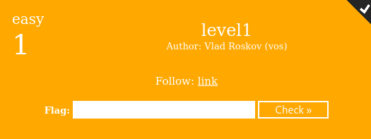

Follow the link, grab the easiest flag ever ^^

---

## Level 2

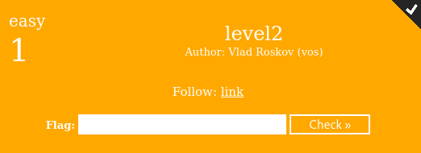

Follow the link, find the flag in the HTML:

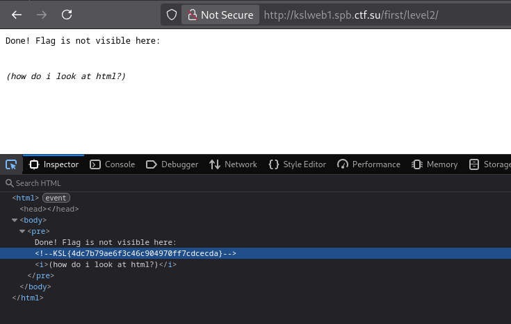

---

## Level 3

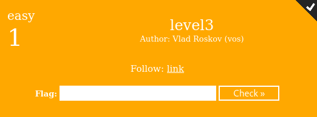

Oh, a situation.

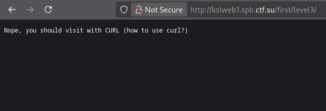

Say hello to my little friend, `curl`. Of course, we could try playing with the User-Agent, but we're cool hackers — we do everything in the terminal:

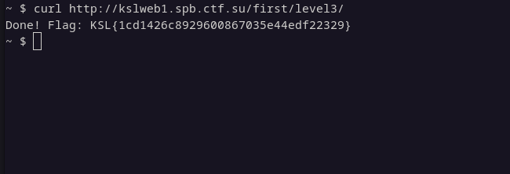

Here ^^

---

## Level 4

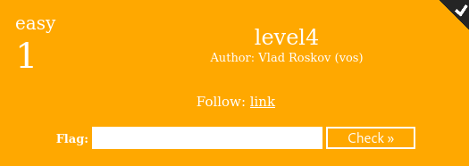

Continuing the conversation:

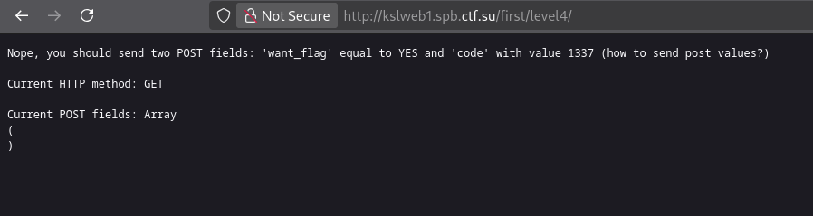

Again, let's use `curl` and successfully get the flag:

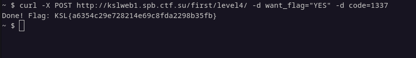

---

## Level 5

Learning URL encoding, no SMS or registration required ^^

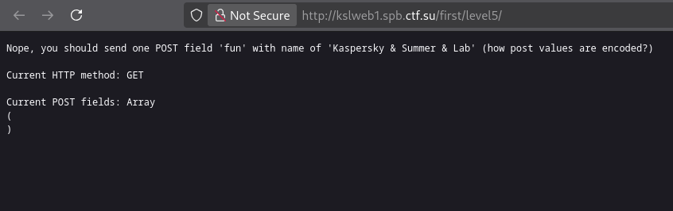

And `curl` comes to the rescue again:

---

## Level 6

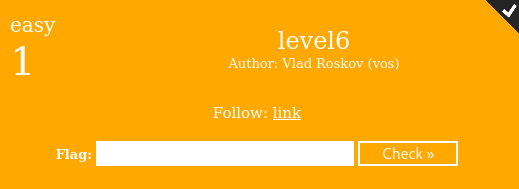

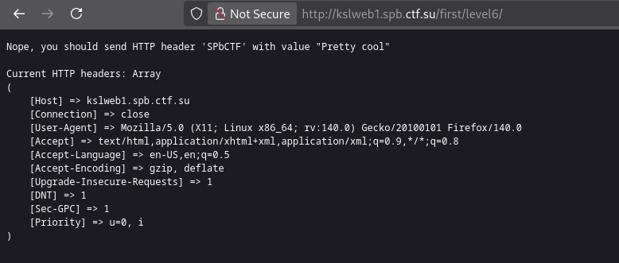

Again, we start curling, sending the required headers:

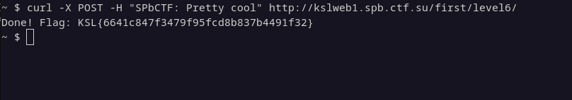

---

## Level 7

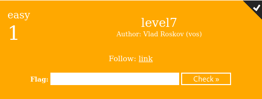

I remember this task gave me a lot of headaches, all because of the wrong cookie token format in the file.

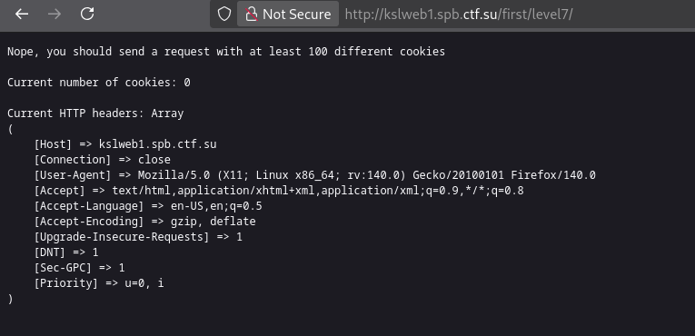

We create a file in a way `curl` can parse it (as shown in the photo) and send the request:

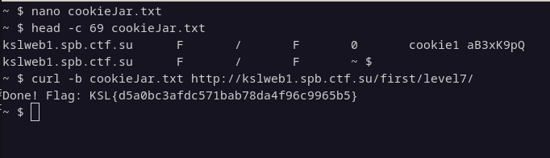

---

## Level 8

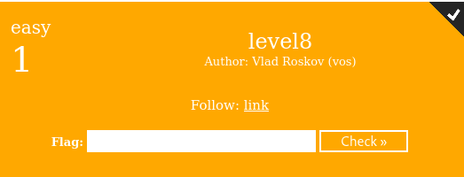

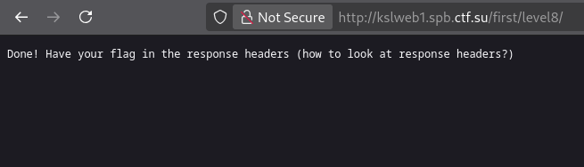

This time, I got too lazy to do terminal gymnastics, so I just found the little flag in the dev tools:

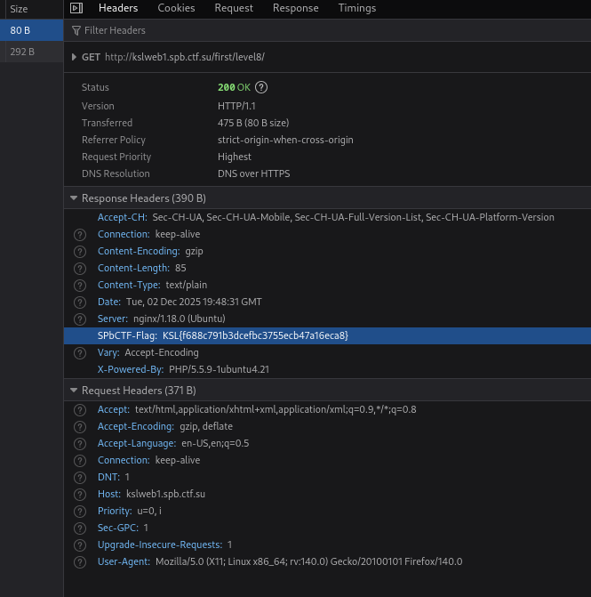

---

## Level 9

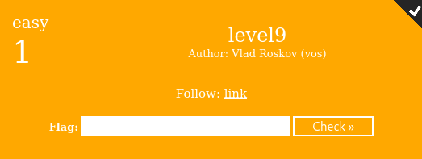

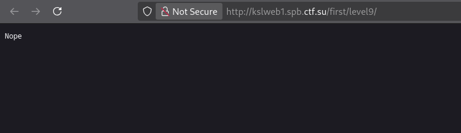

Huh? ((

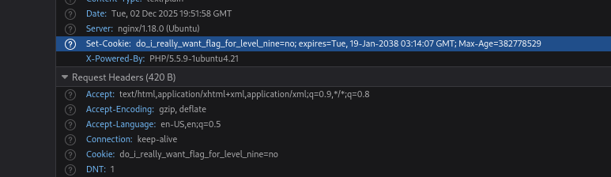

Noticed an interesting cookie with a telling name — we can try to spoof it:

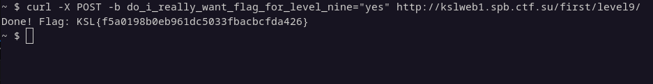

And that gives us the flag ^^

---

## Level 10

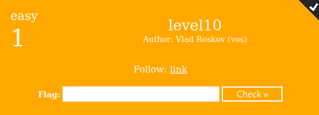

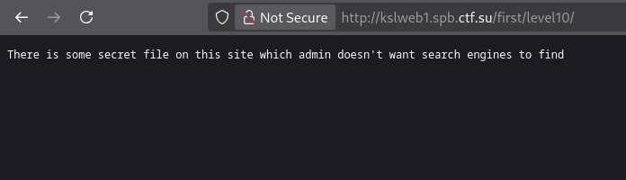

Let's check the contents of `robots.txt`:

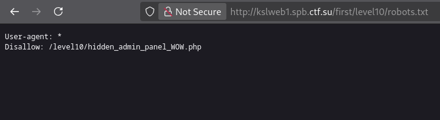

Now, let's go to the discovered directory and get the flag:

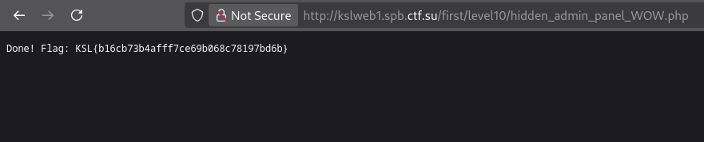

---

## Level 11

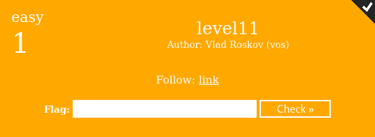

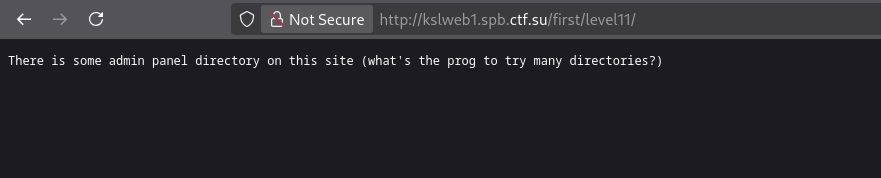

Let's fuzz the application with a basic `dirbuster` scan:

Surprisingly, it took a very long time (I stopped it when it found something), but it still highlighted the needed endpoint.

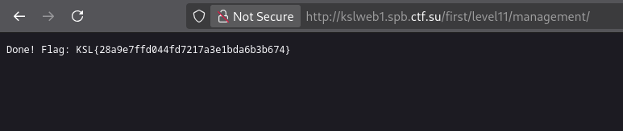

Going there gives us the flag.

---

## Level 12

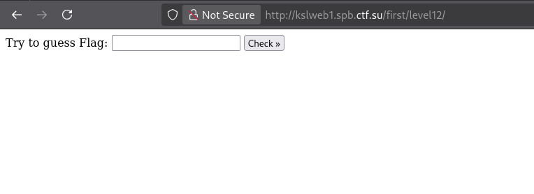

Let's poke around the application's functionality:

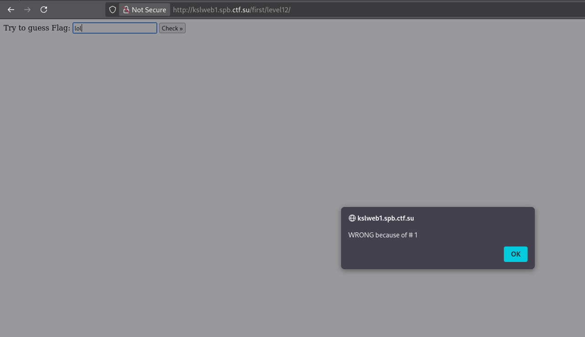

Check the dev tools:

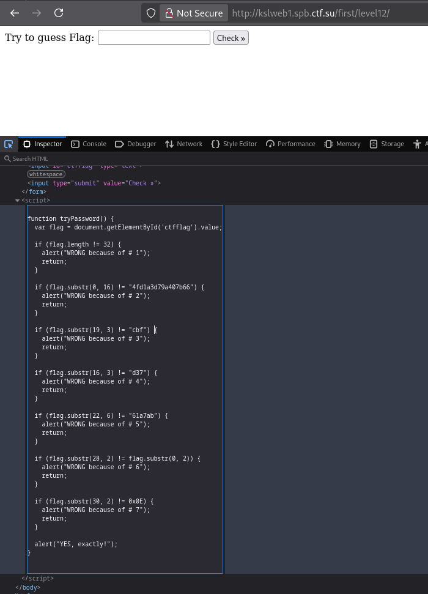

All that's needed to solve this is to carefully trace the code and piece together the flag bit by bit:

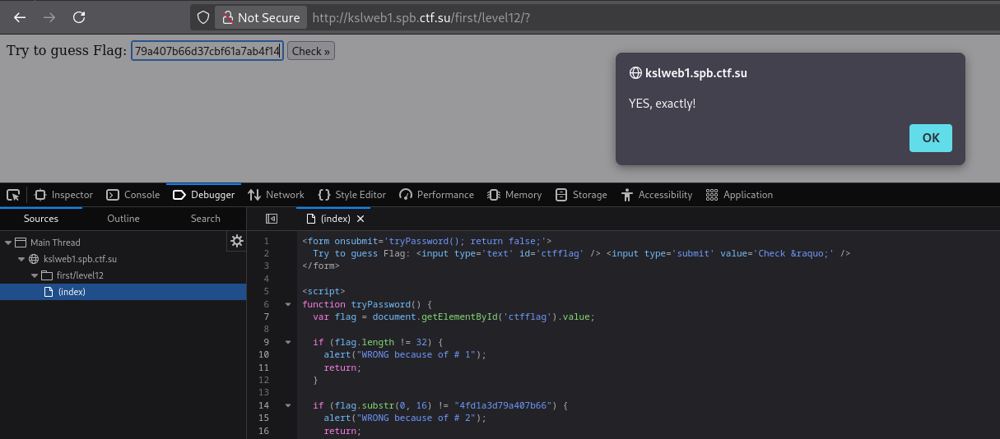

---

## Level 13

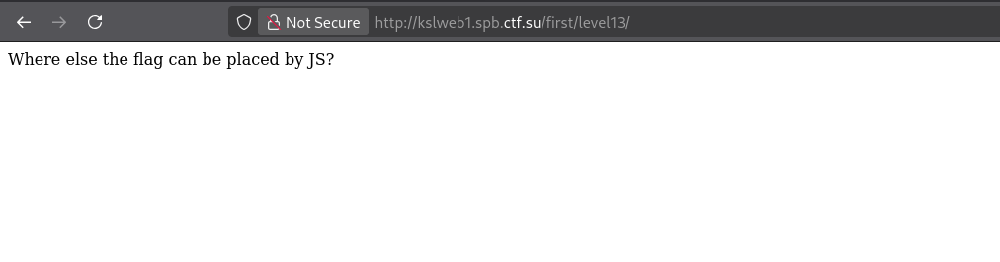

If you open the dev tools, you'll see `JsFuck`:

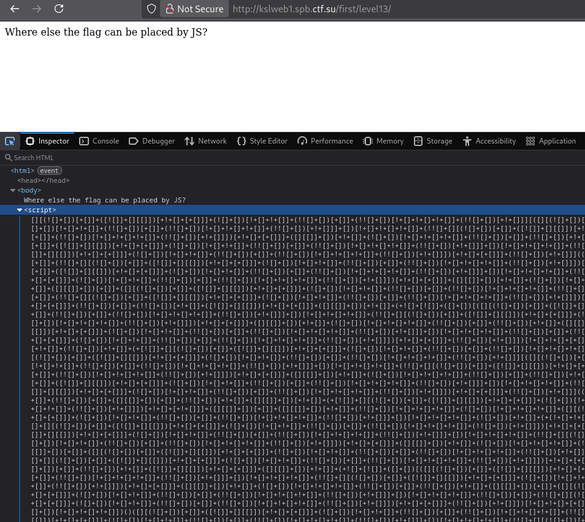

Let's decode this JsFuckery:

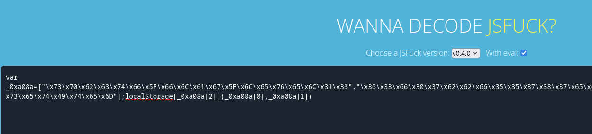

Something related to `localStorage` — let's check it, can't hurt ^^

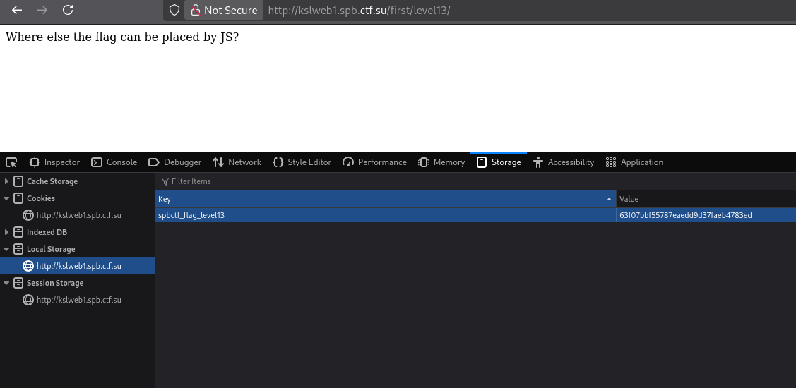

Indeed, the flag is there. Wrap it in KSL{} and enjoy life.

---

## Level 14

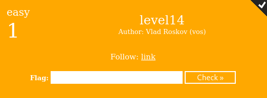

So, the final level.

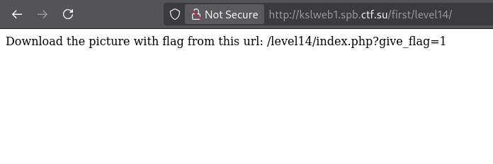

Hmm, okay, let's call the provided endpoint:

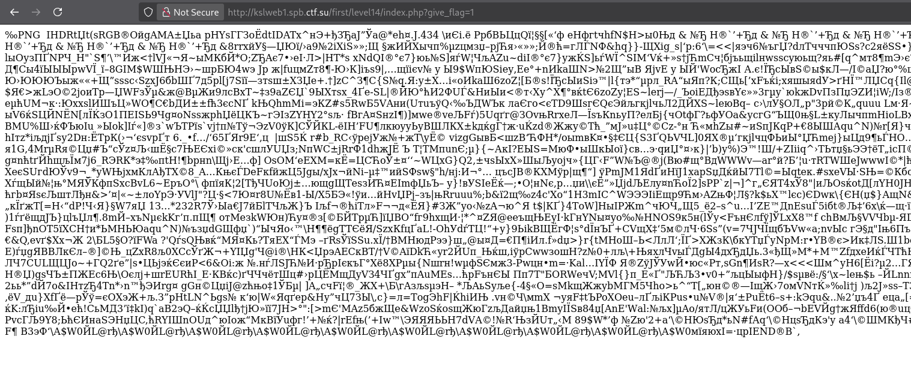

Oi mate, the file is foooooookin raw ^^
Let's download it via `curl`:

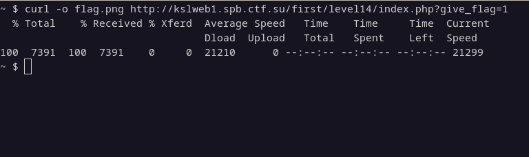

Here it is:

That's all for the `easy` category.

# Thank you for your attention!